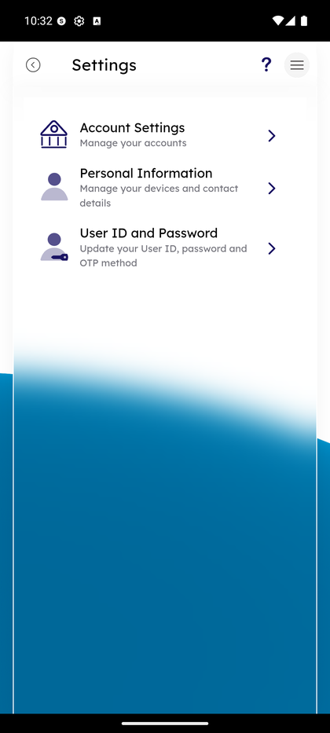

# Settings & Preferences

_Summerville Mobile › Profile & Preferences › Settings & Preferences_

## Profile & Preferences: Settings & Preferences

> The preference tree for account-level toggles, security settings, and display preferences. The Settings landing screen has three top-level sections: **Account Settings**, **Personal Information**, and **User ID and Password**.

**How to get here:** Side Menu (☰) → **Settings**

### Step-by-Step Workflow

#### Step 1: Open the Side Menu

Tap the **☰** hamburger icon at the top-right of any screen. The Side Menu drawer slides in.

#### Step 2: Tap Settings

In the Side Menu, tap **Settings — Account and security settings**. The Settings landing loads.

#### Step 3: Settings Landing — Three Sections

The Settings screen shows three rows, each opening a different sub-area:
- **Account Settings — Manage your accounts** — rename accounts, toggle visibility, set defaults for transfers/check deposit/text banking.
- **Personal Information — Manage your devices and contact details** — phone numbers, email addresses, mailing/residential addresses, manage devices.
- **User ID and Password — Update your User ID, password and OTP method** — credential and step-up management.

Tap the row for the area you want to drill into.

### Summary

Settings is the one-stop hub for everything that isn't a category-level alert preference. Account Settings handles per-account display and default preferences. Personal Information consolidates every contact-data action — phone, email, address, devices — into one menu. User ID and Password handles credential changes. Membership Settings (the read-only ownership and beneficiary view) is reached via the Account Settings tabs once you're inside.

### Key Use Cases

* Member wants to rename checking to something friendlier: Settings → Account Settings → Rename.
* Member's phone number changed: Settings → Personal Information → Phone Number.
* Member wants to change User ID or reset password: Settings → User ID and Password.
* Member confirms beneficiaries are on file: Settings → Account Settings → Membership settings tab.
