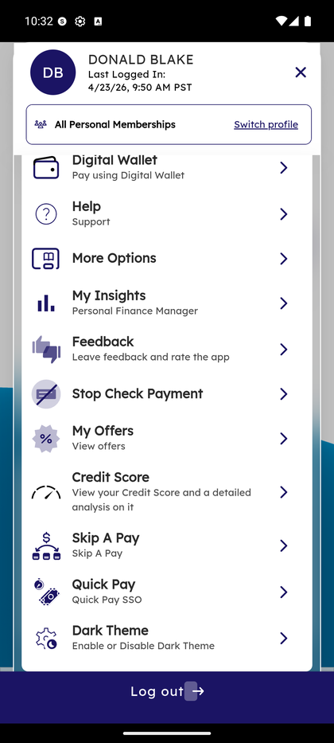
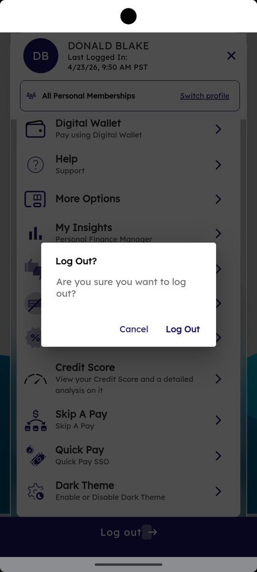

# Side Menu

_Summerville Mobile › Profile & Preferences › Side Menu_

## Profile & Preferences: Side Menu (Hamburger Drawer)

> The complete map of everything that isn't on the bottom navigation. Tap the hamburger icon in the top-right of any screen and this drawer slides in. The top of the drawer is your profile card and a master alerts toggle; below that is the full list of features.

### Step-by-Step Workflow

#### Step 1: Open the Side Menu

Tap the three-line **☰ hamburger icon** at the top-right of any screen. The drawer slides in with your name (**DONALD BLAKE**), your last login timestamp (e.g., *4/23/26, 9:50 AM PST*), a **Switch profile** link (for members with business memberships), and the **Enable alerts** master toggle at the top.

#### Step 2: Scroll Through the Full Menu

The menu has these rows top to bottom:
- **Settings** — account-level preferences (default accounts, nicknames, language).
- **Alert Settings** — account, general, do-not-disturb, and notification preferences.
- **Trust this Device** — promote this device from "Remembered" to "Trusted" so OTP isn't required every time.
- **Apply for Loans** — calculators and rate sheets for loan products.
- **Statements & eNotices** — view statements and toggle paper vs. electronic delivery.
- **Digital Wallet** — link your Summerville card to Google Pay or Samsung Pay.
- **Help** — support ticket list and "Connect with us" starter.
- **More Options** — Contact us, Branch and ATM locator, Card fraud alerts, Disclosures, Text banking, Close Account.
- **My Insights** — Personal Finance Manager (PFM) view.
- **Feedback** — free-text feedback form.
- **Stop Check Payment** — stop a check you wrote.
- **My Offers** — view offers.
- **Credit Score** — SavvyMoney credit score widget.
- **Skip A Pay** — defer a loan payment by one cycle.
- **Quick Pay** — Quick Pay SSO shortcut.
- **Dark Theme** — enable or disable Dark Theme.
- **Log out** — end the current session (pinned at the bottom).

#### Step 3: Log Out Confirmation

Tapping **Log out** opens a confirm dialog: *"Are you sure you want to log out?"* with **Cancel** and **Log Out** buttons. Tap **Log Out** to end the session immediately. If you pick Cancel you stay in the current session with no change.

### Summary

The Side Menu is the wayfinding home for everything outside the four bottom tabs (Dashboard / Accounts / Move Money / Deposit). Items are ordered by member frequency — Settings and Alert Settings at the top because they're the most-visited preference surfaces; Feedback, Offers, Dark Theme, and Log out near the bottom because they're lower-frequency. The profile header at the very top doubles as the entry to the business context switcher via **Switch profile**.

### Key Use Cases

* First-time member exploring the app: open the Side Menu once to see everything available — it's the full feature map in one place.
* Log out before handing your phone to someone: **☰** → scroll to **Log out** → **Log Out** in the confirm dialog.
* Switch from personal to business context: **☰** → **Switch profile** in the profile header → pick your business.
