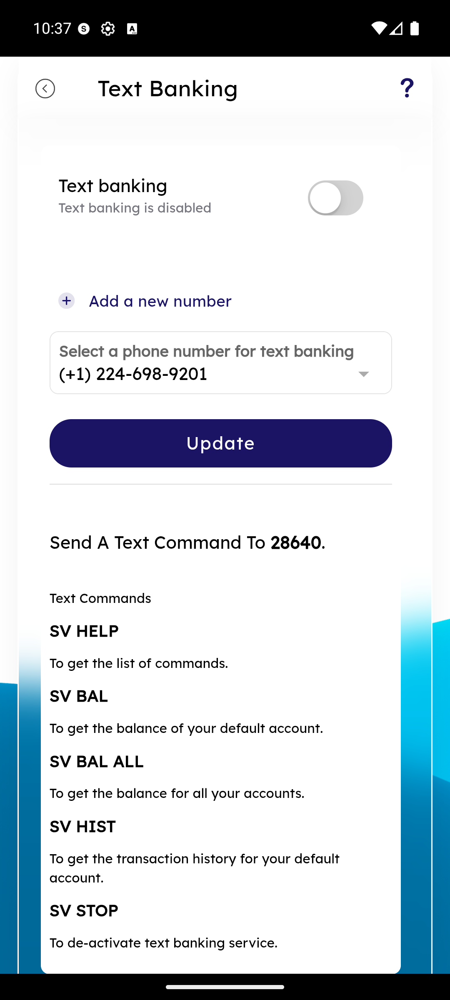

# Text Banking

_Summerville Mobile › Profile & Preferences › Text Banking_

## Profile & Preferences: Text Banking

> SMS-based banking for members who want balance / history info without opening the app — enrollment is a single toggle plus a verified phone number, with a short command reference: SV HELP, SV BAL, SV BAL ALL, SV HIST, SV STOP.

### Step-by-Step Workflow

#### Step 1: Enroll in Text Banking

From More Options → Text Banking, the screen shows the **Text banking** toggle (default Off with the status line *"Text banking is disabled"*), a **+ Add a new number** link, and a **Select a phone number for text banking** dropdown pre-populated with the member's on-file cellular numbers (e.g., *(+1) 224-698-9201*). Toggle on, pick a number, tap **Update** to enroll.

#### Step 2: Review SMS Command Reference

Below the enrollment controls, the **Send A Text Command To 28640** section lists the supported commands: **SV HELP** (list commands), **SV BAL** (default account balance), **SV BAL ALL** (balances for all accounts), **SV HIST** (transaction history for default account), **SV STOP** (deactivate text banking). Members text the command to 28640 from the enrolled number; a reply arrives in a few seconds.

### Summary

Text banking is the offline-safe channel — when the app is broken, the phone has no data, or the member is on an old device, a quick SV BAL returns the balance via SMS. It's not a replacement for the app, it's a resilience feature. **SV STOP** is the most-asked support question — members sometimes opt in and then want out; the command works and self-service dis-enrolls without a call.

### Key Use Cases

* Member with spotty cellular data: SV BAL returns balance even when the app can't load.
* Member on a flight with SMS-only connectivity: SV HIST returns the last N transactions.
* Member wants to opt out: text SV STOP to 28640, or return to this screen and toggle off.
