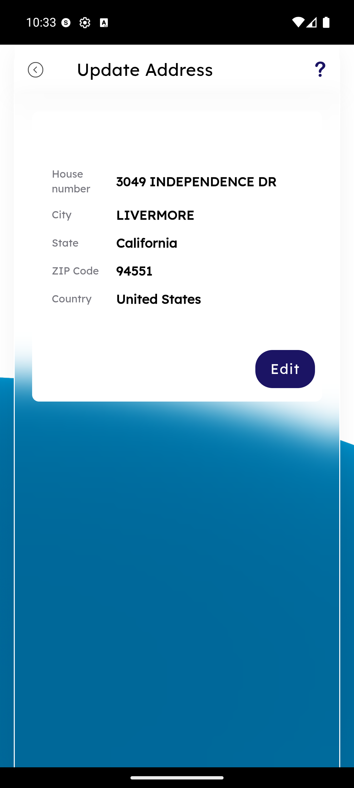
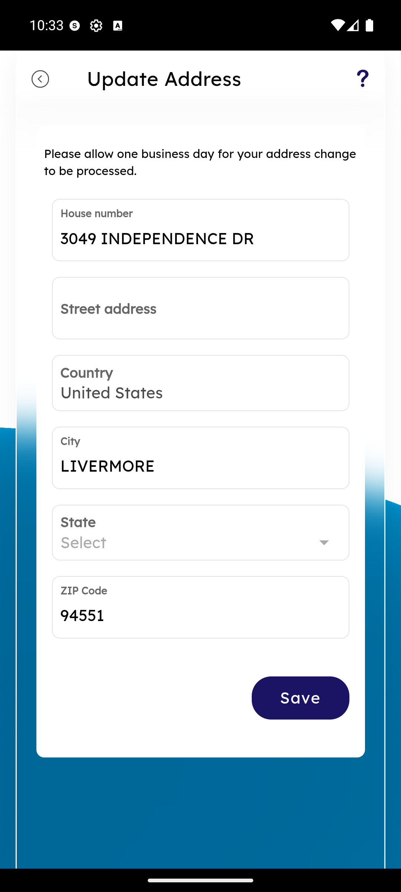

# Update Address

_Summerville Mobile › Profile & Preferences › Update Address_

## Profile & Preferences: Update Address

> Read-then-edit pattern — the current address is shown in a summary card, and the **Edit** button is the only way to enter the modification form, so the member is always looking at what's on file before they change it.

**How to get here:** Side Menu (☰) → Settings → Personal Information → **Mailing Address** (or **Residential Address**)

### Step-by-Step Workflow

#### Step 1: Review Current Address

The summary card shows the full structured address on file: **House number**, **City**, **State**, **ZIP Code**, **Country** (e.g., 3049 INDEPENDENCE DR, LIVERMORE, California, 94551, United States). Verify this matches what the member expects before tapping Edit; if it's already correct, back out — no edit needed.

#### Step 2: Edit and Save

Tap **Edit** to open the structured-field edit form. Fields: **House number**, **Street address**, **Country**, **City**, **State** (dropdown), **ZIP Code**. The screen carries a plain-language note *"Please allow one business day for your address change to be processed"* — set expectations with the member before they Save. On tap, the change triggers a core-system sync; downstream address-dependent services (card reissuance, statement mailing) pick up the new address on their next scheduled event, and the change is logged to Support History for audit.

### Summary

Address updates propagate slowly by design — the core takes a few minutes, and downstream services (card reissuance mailing, statement mailing) can take days to pick up the change. Because of that cascade, members changing address just before a card reissuance should be routed through support to confirm the card mail goes to the new address; that's the one scenario where self-service isn't sufficient. The structured-field design (house number / city / state / ZIP / country) forces clean data entry instead of a free-text address that would need parsing downstream.

### Key Use Cases

* Member moves within the same state: Edit → change house number, city, ZIP → Save → new statements mail to the new address next cycle.
* Member realizes their card is at the old address: call support from the Help menu to expedite reissuance to the correct address.
* Address is already correct on file: back out — no action needed, and no-op edits still trigger core syncs so avoid them.
