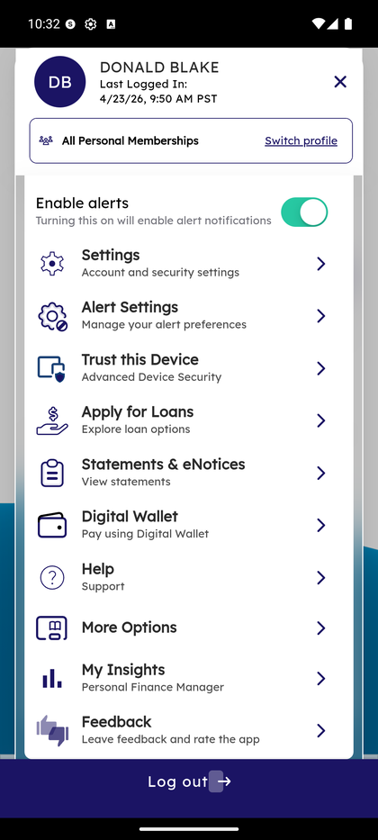
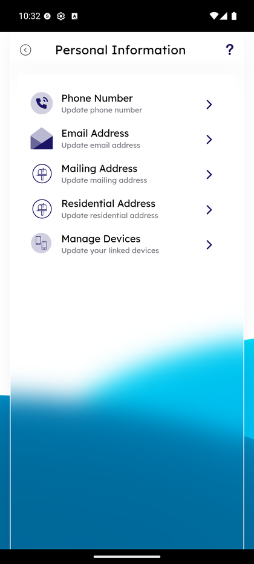
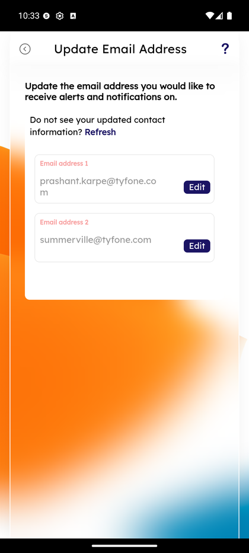
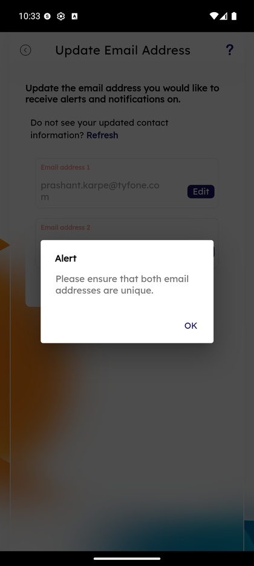

# Update Email Address

_Summerville Mobile › Profile & Preferences › Update Email Address_

## Profile & Preferences: Update Email Address

> Multi-email profile with per-email **Edit** action, a uniqueness validation that rejects duplicates, and an **+ Add a new email** entry point for additional addresses. Same pattern as phone numbers.

**How to get here:** Side Menu (☰) → **Settings** → **Personal Information** → **Email Address**

### Step-by-Step Workflow

#### Step 1: Open the Side Menu

Tap the **☰** hamburger icon at the top-right of any screen.

#### Step 2: Tap Settings → Personal Information

In the Side Menu, tap **Settings**, then tap **Personal Information**.

#### Step 3: Tap Email Address

On the Personal Information menu, tap **Email Address — Update email address** (second row). The Update Email Address screen loads.

#### Step 4: Review the List of Emails

The **Update Email Address** screen lists every email on file (e.g., *Email address 1 — prashant.karpe@tyfone.com*, *Email address 2 — summerville@tyfone.com*) with an **Edit** button per row. Contextual text reads *"Update the email address you would like to receive alerts and notifications on."* A **Refresh** link at the top pulls fresh core data when a branch update hasn't propagated yet.

#### Step 5: Edit With Uniqueness Check

Tap **Edit** on any row to update that specific address. If the new address matches another email already on file, an **Alert** dialog fires: *"Please ensure that both email addresses are unique."* Tap **OK** to dismiss and correct the entry. Save the edited address when it's unique and valid.

### Summary

Email is the fallback delivery channel for alerts and eStatement notices, so the uniqueness check isn't cosmetic — allowing duplicates would let a single address double up on delivery. Multiple emails on file are useful for redundancy (personal + work) — both receive every alert. The pattern (list + Edit + uniqueness validation + Add) matches the phone-number screen because both are identity-verified contact channels; the difference is email bounces don't immediately block sign-in, where a bad phone number blocks OTP.

### Key Use Cases

* Member moves from personal to work email: **Edit** Email address 1 → save → new address receives alerts.
* Member wants redundancy (personal + work email both subscribed): use **+ Add a new email** to add the second address — both receive alerts.
* Member attempts to save a duplicate: uniqueness alert fires, no save — correct the entry before retrying.
* Email no longer receiving alerts: **Refresh** first (branch may have updated the core), then edit if the address on file is actually stale.
