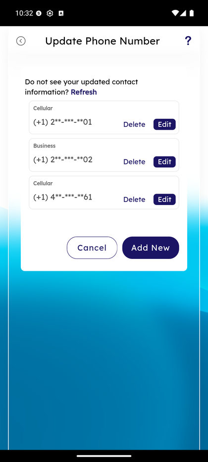
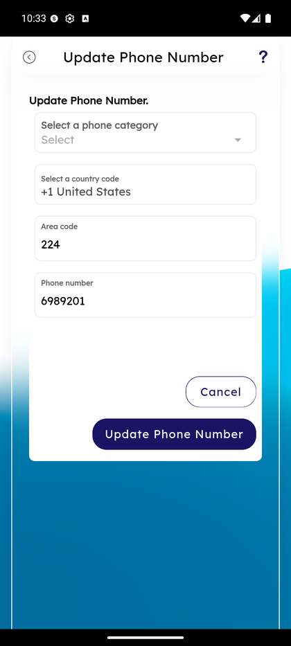
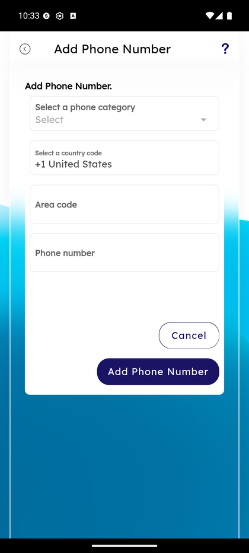
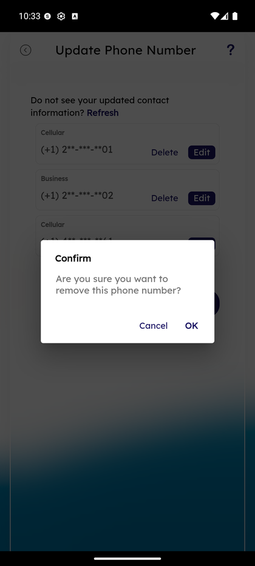

# Update Phone Number

_Summerville Mobile › Profile & Preferences › Update Phone Number_

## Profile & Preferences: Update Phone Number

> The phone-number-of-record is used for OTP step-up across Zelle, FedNow, and login. Three actions live on this screen — **Edit** an existing number, **Add New**, or **Delete** one — with a confirm dialog on delete so you can't lose OTP access by mistake.

### Step-by-Step Workflow

#### Step 1: Open the Side Menu

Tap the **☰** hamburger icon at the top-right of any screen.

#### Step 2: Tap Settings → Personal Information

In the Side Menu, tap **Settings**, then tap **Personal Information**.

#### Step 3: Tap Phone Number

On the Personal Information menu, tap **Phone Number — Update phone number** (first row). The Update Phone Number screen loads.

#### Step 4: Review the List of Numbers

The list shows every phone number on file grouped by category (**Cellular**, **Business**, **Home**) with masked digits (e.g., *(+1) 2\*\*-\*\*\*-\*\*01*). Each row has two actions: **Edit** (change category or number) and **Delete** (remove). A **Refresh** link at the top pulls fresh core data. At the bottom: **Cancel** exits; **Add New** opens the Add form.

#### Step 5: Edit an Existing Number

Tap **Edit** on any row. The **Update Phone Number** form opens with **Select a phone category** (Home / Cellular / Business dropdown), **Select a country code** (defaults to **+1 United States**), **Area code** (e.g., *224*), and **Phone number** (e.g., *6989201*) — pre-populated from the existing record. Change what you need and tap **Update Phone Number** to save; **Cancel** discards.

#### Step 6: Add a New Number

From Step 4, tap **Add New** to open the same-shape form with empty fields. Enter **Phone category**, keep **+1 United States** (or pick another country), enter **Area code** and **Phone number**, tap **Add Phone Number**. The new number appears in the list immediately and can receive OTPs on the next attempt.

#### Step 7: Delete a Number (With Confirm Dialog)

Tap **Delete** on any row. A **Confirm** dialog asks *"Are you sure you want to remove this phone number?"* with **Cancel** and **OK** buttons. Tap **OK** to remove — the number is deleted immediately and any OTP routing that referenced it will fail on the next attempt. Tap **Cancel** to keep the number.

### Summary

Phone number changes on this screen flow back to the core via a sync so OTPs route correctly on the next send. The **Refresh** link pulls the latest core record when a branch update hasn't propagated yet. Before deleting a number, always verify at least one other Cellular number remains on file — removing the last cellular is the fastest way to lock yourself out of Zelle and FedNow step-up. The **+1 United States** country-code default in Add/Edit is correct for 99% of US members; international members should pick their country before entering the area code and number.

### Key Use Cases

* Member switches carriers: **Add New** with the new number first, verify it routes OTP correctly, then **Delete** the old one.
* Category wrong (labeled Cellular when it's actually Home): **Edit** the row → change category dropdown → **Update Phone Number**.
* Accidentally tapped Delete: the **Confirm** dialog gives you one chance to tap **Cancel** before the number is gone.
* Branch updated the number on the core but OTP still going to the old one: tap **Refresh** at the top to sync the fresh record.
