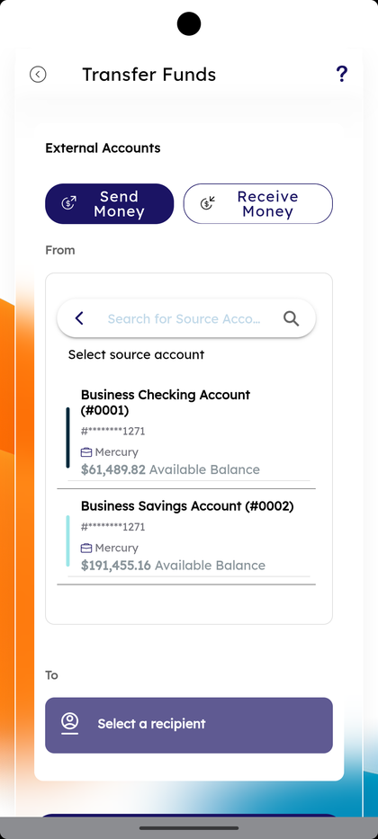
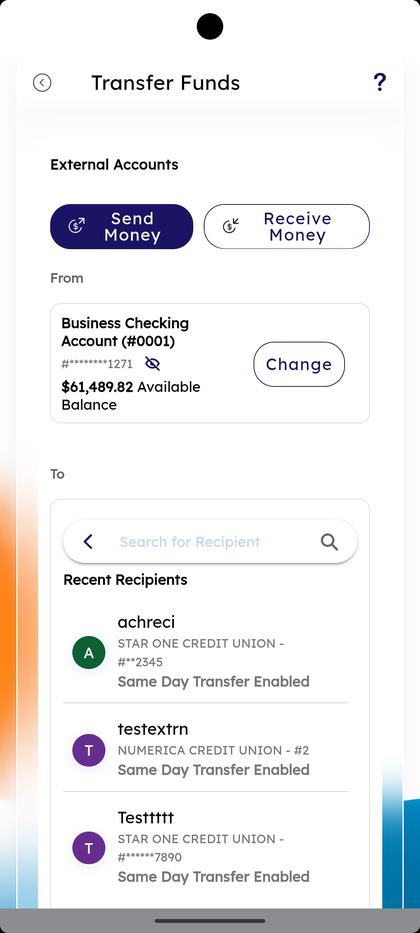
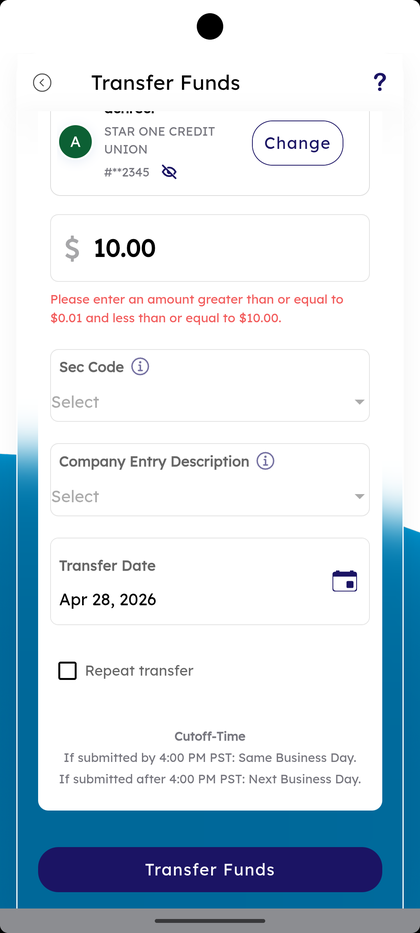
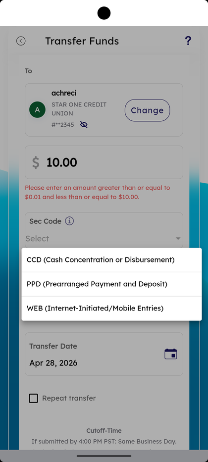
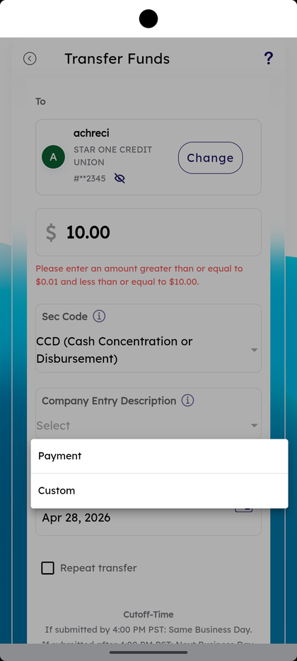
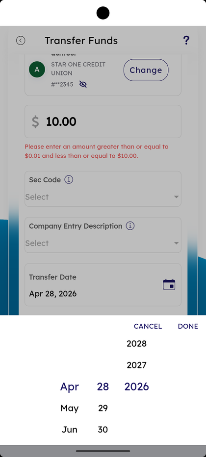
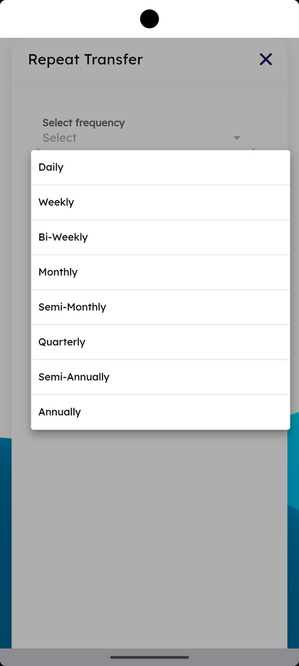
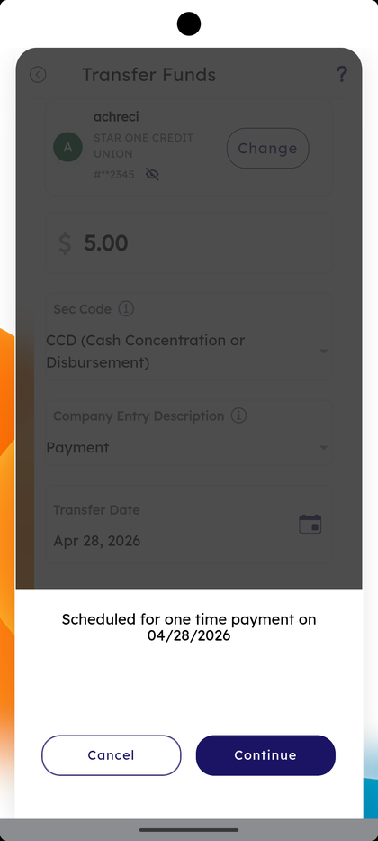
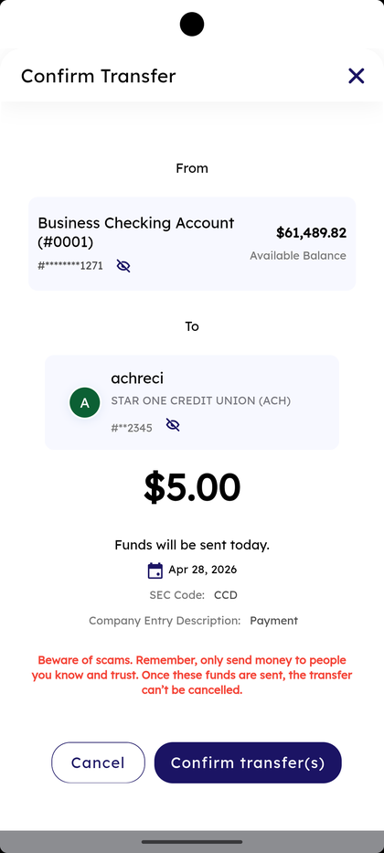
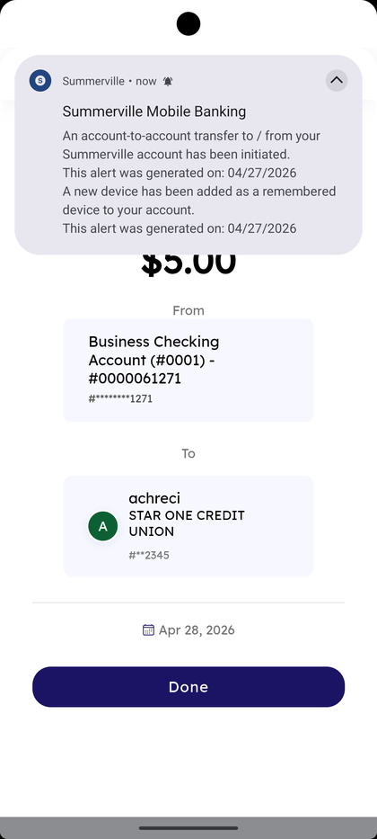

# ACH Transfer

_Summerville Mobile › Business Banking › ACH Transfer_

## Business Banking: ACH Transfer

> The Transfer Funds flow for ACH — Send Money or Receive Money to/from external accounts, pick Sec Code (CCD / PPD / WEB) and Company Entry Description, set Transfer Date, optionally Repeat transfer, then confirm.

**How to get here:** Side Menu (☰) → **Business Settings** → **ACH Transfer**

### Step-by-Step Workflow

#### Step 1: Open Business Settings → ACH Transfer

From Side Menu (☰) → **Business Settings**, tap **ACH Transfer**. The **Transfer Funds** form opens with **External Accounts** at the top.

#### Step 2: Pick Send Money or Receive Money

At the top of Transfer Funds, choose **Send Money** or **Receive Money**. The toggle controls direction for the rest of the flow.

#### Step 3: Pick a Source Account

Under **From** the **Search for Source Account** field opens a list of business accounts (e.g., Business Checking Account, Business Savings Account) with masked numbers and Available Balance. Tap the account to load it as the source.

#### Step 4: Pick a Recipient

Under **To**, tap **Select a recipient**. The Search for Recipient field opens with **Recent Recipients** below — each row shows the recipient name, the receiving institution, and *"Same Day Transfer Enabled"* if eligible.

#### Step 5: Enter Amount

Tap the dollar field and type the amount. The form shows the helper *"Please enter an amount greater than or equal to $0.01 and less than or equal to $10.00."* — the upper limit is the per-transaction cap on the role.

#### Step 6: Pick a Sec Code

Tap the **Sec Code** dropdown and choose one: **CCD (Cash Concentration or Disbursement)**, **PPD (Prearranged Payment and Deposit)**, or **WEB (Internet-Initiated/Mobile Entries)**.

#### Step 7: Pick a Company Entry Description

Tap **Company Entry Description** and choose **Payment** or **Custom**. Custom lets you type a description that appears on the receiving statement.

#### Step 8: Pick the Transfer Date

Tap the **Transfer Date** calendar and use the month/day/year wheel. The footer reads *"Cutoff-Time — If submitted by 4:00 PM PST: Same Business Day. If submitted after 4:00 PM PST: Next Business Day."*

#### Step 9: Optionally Repeat Transfer

Tick **Repeat transfer**. The **Repeat Transfer** sheet opens with **Select frequency** (**Daily / Weekly / Bi-Weekly / Monthly / Semi-Monthly / Quarterly / Semi-Annually / Annually**) and **End on** (**End Date** or **Until I Cancel**). Tap **Save**.

#### Step 10: Tap Transfer Funds and Continue

Tap **Transfer Funds** at the bottom. A sheet appears: *"Scheduled for one time payment on MM/DD/YYYY"* with **Cancel** and **Continue** — tap **Continue** to keep going.

#### Step 11: Confirm Transfer

The **Confirm Transfer** screen shows From, To, the amount, **Funds will be sent today**, **SEC Code**, **Company Entry Description**, and the warning *"Beware of scams. Remember, only send money to people you know and trust. Once these funds are sent, the transfer can't be cancelled."* Tap **Confirm transfer(s)**.

#### Step 12: Success and Done

The success screen shows From, To, the transfer date, and a Summerville alert: *"An account-to-account transfer to / from your Summerville account has been initiated."* Tap **Done** to return.

### Summary

ACH Transfer is the workhorse for batch business payments — pick the right Sec Code (CCD for business-to-business, PPD for payroll, WEB for online entries) and Company Entry Description so the receiving statement reads correctly. The 4:00 PM PST cutoff decides whether the transfer settles same business day or next. Repeat transfer turns a single send into a recurring schedule with a clear End on rule.

### Key Use Cases

* Vendor payment between two businesses: **Send Money**, **CCD**, **Company Entry Description: Payment**.
* Payroll or recurring contractor payment: **Send Money**, **PPD**, **Repeat transfer — Bi-Weekly**, **End on — Until I Cancel**.
* Pull funds from an external business account: **Receive Money** with the matching Sec Code.
* One-off custom-labelled transfer: **Company Entry Description — Custom** to show the line on the receiving statement.
