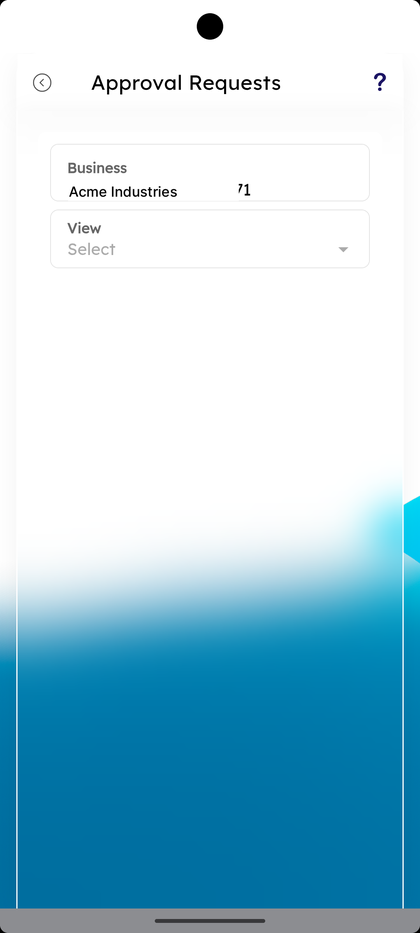
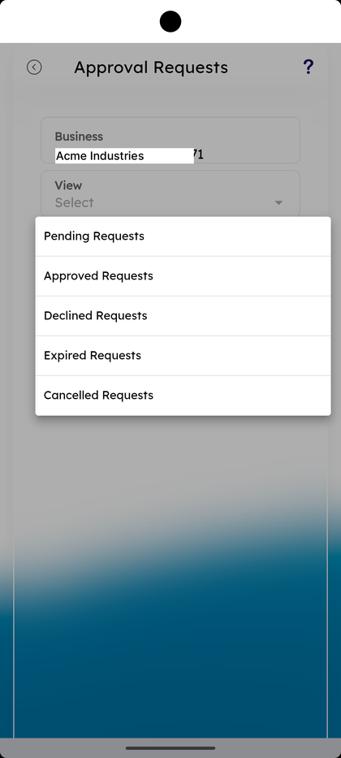
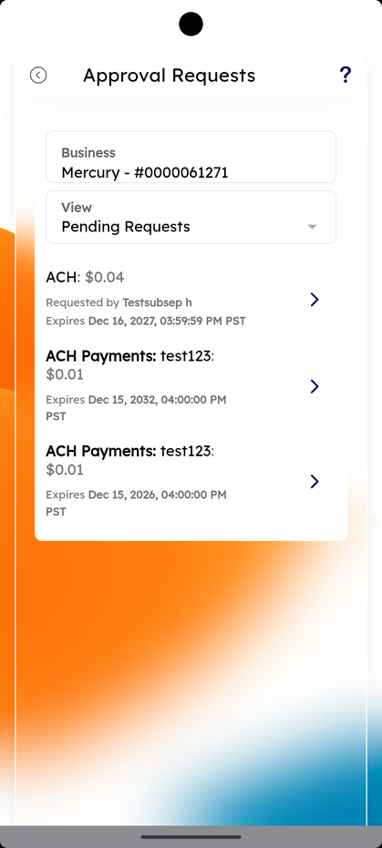
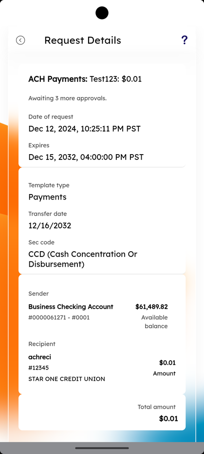

# Approval Requests

_Summerville Mobile › Business Banking › Approval Requests_

## Business Banking: Approval Requests

> The Approval Requests queue — pending, approved, declined, expired, and cancelled transactions awaiting an approver's decision. Each row shows transaction type, amount, who requested it, and an expiry. Tapping a row opens the full Request Details with sender, recipient, and totals.

**How to get here:** Side Menu (☰) → **Business Settings** → **Approval Requests**

### Step-by-Step Workflow

#### Step 1: Open Approval Requests

From Side Menu (☰) → **Business Settings**, scroll to **More Options** and tap **Approval Requests — Accept or Decline the approval requests**. The screen shows the **Business** card with the membership and a **View** dropdown defaulted to **Select**.

#### Step 2: Pick a Status Filter

Tap the **View** dropdown. Five filters appear: **Pending Requests**, **Approved Requests**, **Declined Requests**, **Expired Requests**, **Cancelled Requests**. Pick one.

#### Step 3: Review the Pending Requests List

With **Pending Requests** selected, each card shows the transaction type and amount (e.g., **ACH: $0.04** or **ACH Payments: <template>: $0.01**), **Requested by <user>**, and **Expires <date and time> PST**. Tap any card to open Request Details.

#### Step 4: Review Request Details and Act

The **Request Details** screen shows the transaction type and amount, *"Awaiting N more approvals."*, **Date of request**, **Expires**, **Template type**, **Transfer date**, **Sec code**, **Sender** (Business Checking Account with masked number and Available balance), **Recipient** (with masked account and receiving institution), the per-recipient **Amount**, and **Total amount**. Approve or decline from this screen — each approval drops the **Awaiting N more approvals** counter by one.

### Summary

Approval Requests is where the dual-control rule from Approval Settings actually plays out. The **Awaiting N more approvals** line is the live counter: each approval drops it by one until the transaction can process. The status filters let an approver focus — Pending today, Expired this week, Cancelled to audit user behaviour. Expiry timestamps prevent stale approvals from sitting in the queue forever.

### Key Use Cases

* Daily approver review: open **Pending Requests**, tap each card, approve or decline.
* Audit what was approved this week: filter **Approved Requests**.
* Investigate a transaction that didn't go through: filter **Declined Requests** or **Expired Requests** to see why.
* Track cancellations by initiators: filter **Cancelled Requests**.
