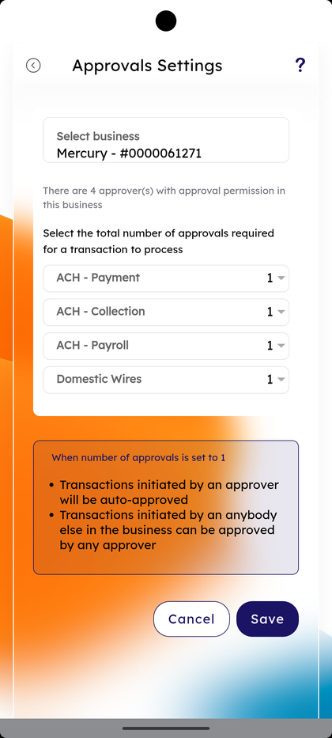
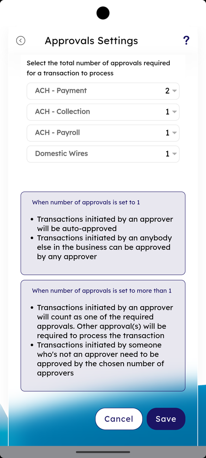

# Approval Settings

_Summerville Mobile › Business Banking › Approval Settings_

## Business Banking: Approval Settings

> The Approvals Settings screen — set the total number of approvals required for each transaction type (ACH — Payment, ACH — Collection, ACH — Payroll, Domestic Wires). Two info blocks explain how transactions behave when the count is set to 1 vs. more than 1.

**How to get here:** Side Menu (☰) → **Business Settings** → **Approval Settings**

### Step-by-Step Workflow

#### Step 1: Open Business Settings → Approval Settings

From Side Menu (☰) → **Business Settings**, scroll to **Manage** and tap **Approval Settings — Manage settings for transactions requiring approvals**. The **Approvals Settings** screen opens.

#### Step 2: Review the Business and Approver Count

The screen shows **Select business** with the active business and the line *"There are 4 approver(s) with approval permission in this business"*. Below is the heading *"Select the total number of approvals required for a transaction to process."*

#### Step 3: Set the Approval Count per Transaction Type

Each transaction type has a numeric stepper: **ACH - Payment**, **ACH - Collection**, **ACH - Payroll**, **Domestic Wires**. Tap the stepper to set how many approvals are required (e.g., 1, 2, or more).

#### Step 4: Read the Rules — Set to 1

A note explains: *"When number of approvals is set to 1 — Transactions initiated by an approver will be auto-approved. Transactions initiated by an anybody else in the business can be approved by any approver."*

#### Step 5: Read the Rules — Set to More Than 1

A second note explains: *"When number of approvals is set to more than 1 — Transactions initiated by an approver will count as one of the required approvals. Other approval(s) will be required to process the transaction. Transactions initiated by someone who's not an approver need to be approved by the chosen number of approvers."*

#### Step 6: Tap Save

Tap **Save** to commit the new approval counts. **Cancel** discards changes.

### Summary

Approval Settings is the per-transaction-type guardrail for outgoing money. **1** means the role with approval permission acts unilaterally; **more than 1** means the initiator's approval counts as one and N additional approvers are required, so a single user can never push a transaction through alone. Different counts for ACH Payments, ACH Collection, ACH Payroll, and Domestic Wires let the business set higher friction on higher-risk rails (a wire can require two approvers while a payroll batch stays at one).

### Key Use Cases

* Tighten domestic wire risk: set **Domestic Wires — 2** while keeping ACH at 1.
* Dual-control ACH payroll: set **ACH - Payroll — 2**.
* Loosen back to single-approver after audit: change each row to **1** and **Save**.
* Audit current rules before adding a new approver: open Approval Settings, read counts, tally with the *"There are N approver(s)"* line.
