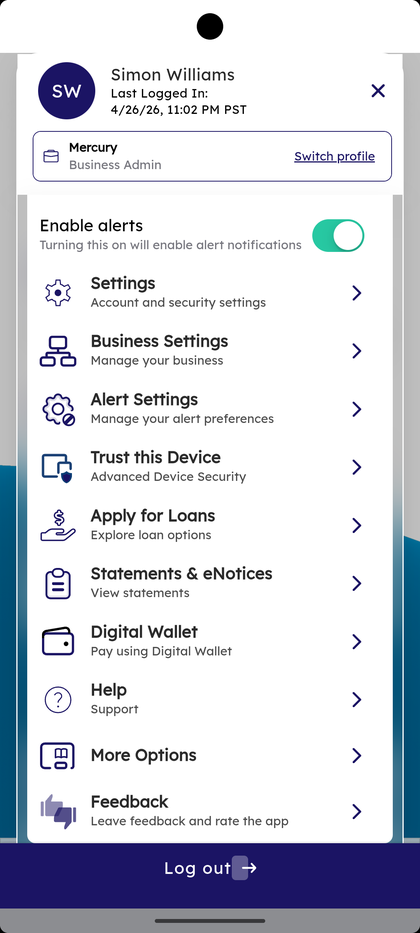

# Business Banking Hub

_Summerville Mobile › Business Banking › Business Settings (Hub)_

## Business Banking: Business Settings (Hub)

> The Business Settings hub — every business banking action in one place. Transfers (Domestic Wire, ACH, P2P, Templates) sit at the top, Manage (Role Management, User Management, Approval Settings, See All Recipients) in the middle, and More Options (Approval Requests, View Scheduled Transfers, Business Contact Information) at the bottom.

**How to get here:** Side Menu (☰) → **Business Settings**

### Step-by-Step Workflow

#### Step 1: Open the Side Menu on a Business Profile

Tap the **☰** hamburger icon at the top-right. The Side Menu shows the active business name and *"Business Admin"* with a **Switch profile** link at the top, confirming you're in the business profile.

#### Step 2: Tap Business Settings

In the Side Menu, tap **Business Settings — Manage your business**. The **Business Settings** hub opens.

#### Step 3: Pick a Transfers Action

Under the **Transfers** section pick one: **Domestic Wire Transfer**, **ACH Transfer**, **P2P Transfer**, or **Templates — Transfer templates**. Each opens its own Transfer Funds form.

#### Step 4: Pick a Manage Action

Scroll to **Manage** and pick one: **Role Management — Manage your roles**, **User Management — Create and Manage user for Business Banking**, **Approval Settings — Manage settings for transactions requiring approvals**, or **See All Recipients**.

#### Step 5: Pick a More Options Action

Scroll to **More Options** and pick one: **Approval Requests — Accept or Decline the approval requests**, **View Scheduled Transfers**, or **Business Contact Information — Update your devices, and contact details**.

### Summary

Business Settings is the single map of business banking on mobile. Transfers move money, Manage controls who can move it and how it's approved, and More Options handles the supporting tasks — pending approvals, scheduled items, and contact details. The hub is reachable from the Side Menu after switching to the business profile.

### Key Use Cases

* Send money: pick a row under **Transfers**.
* Add or change a sub-user or what they can do: **User Management** or **Role Management**.
* Decide how many approvers a transaction needs: **Approval Settings**.
* Approve a pending transaction: **Approval Requests**.
* Update the address, phone, or email on file for the business: **Business Contact Information**.
