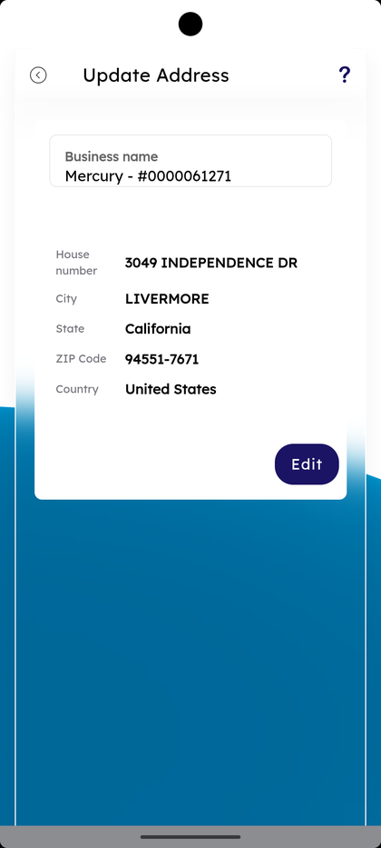
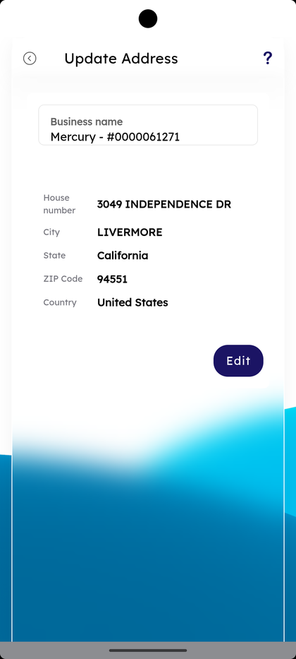
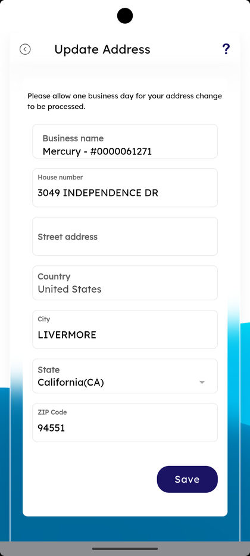
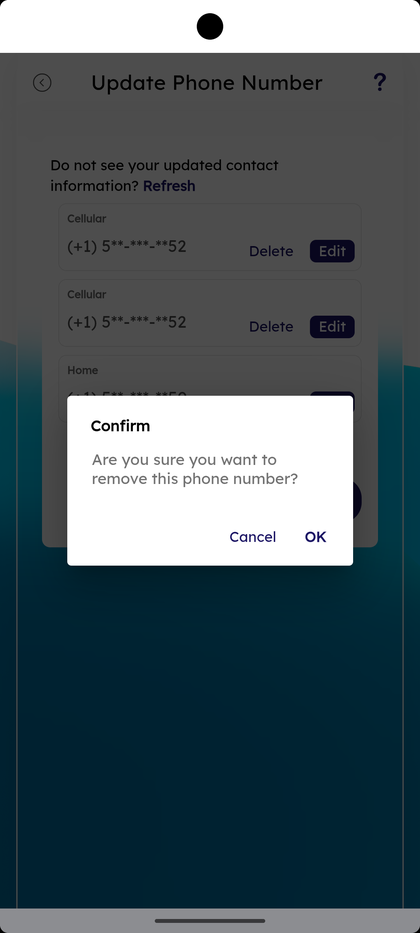
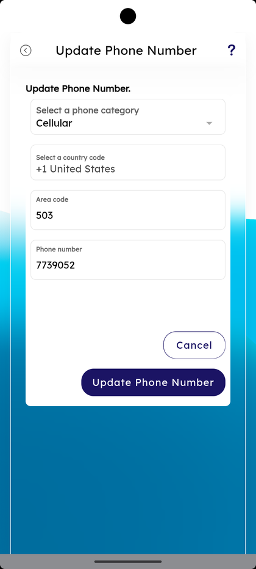
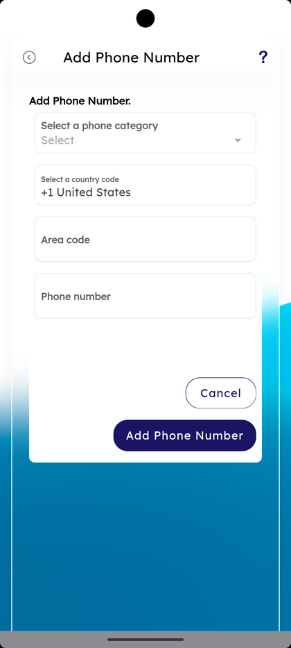
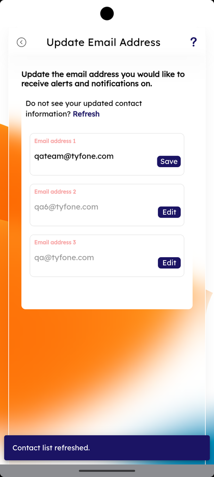
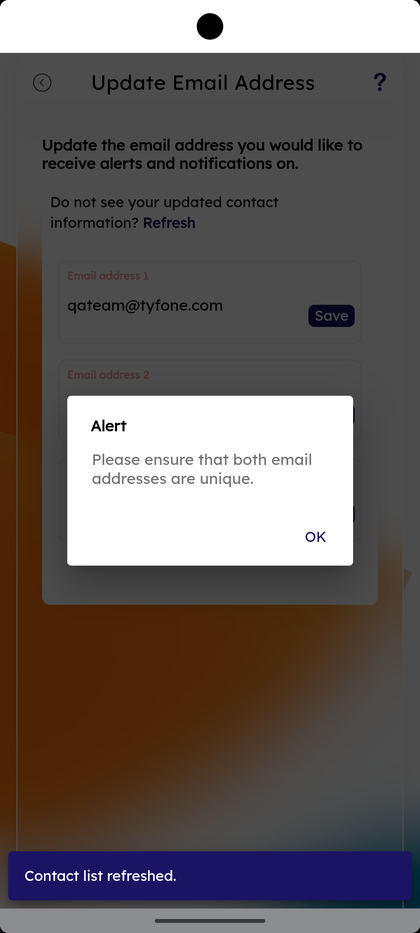
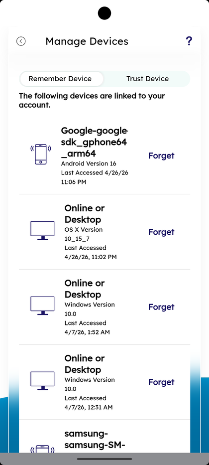

# Business Contact Information

_Summerville Mobile › Business Banking › Business Information_

## Business Banking: Business Contact Information

> The Business Information menu — Mailing Address, Business Address, Phone Number, Email Address, and Manage Devices — for updating the contact information on file for the business profile. Each address has a read-only card with Edit; phone and email use a list with per-row Edit + Delete + Add New + Refresh; Manage Devices has Remember/Trust tabs and per-device Forget with Confirm.

**How to get here:** Side Menu (☰) → **Business Settings** → **Business Contact Information**

### Step-by-Step Workflow

#### Step 1: Open Business Settings → Business Contact Information

From Side Menu (☰) → **Business Settings**, scroll to **More Options** and tap **Business Contact Information — Update your devices, and contact details**. The **Business Information** menu opens.

#### Step 2: Pick the Field to Update

The Business Information menu lists five rows: **Mailing Address — Update mailing address**, **Business Address — Update business address**, **Phone Number — Update phone number**, **Email Address — Update email address**, and **Manage Devices — Update your linked devices**.

#### Step 3: Review Mailing Address

Tap **Mailing Address**. The **Update Address** screen opens read-only with **Business name**, **House number**, **City**, **State**, **ZIP Code**, **Country**, and an **Edit** button.

#### Step 4: Review Business Address

Tap **Business Address**. The **Update Address** screen opens read-only with the same fields and **Edit**.

#### Step 5: Edit the Address

Tap **Edit** on either address. The full form opens with the helper *"Please allow one business day for your address change to be processed."* and the editable fields **Business name**, **House number**, **Street address**, **Country**, **City**, **State**, **ZIP Code**. Tap **Save**.

#### Step 6: Save the Address

Save returns to a fresh Update Address read-only card showing the new values with the Edit button.

#### Step 7: Update Phone Number — Review the List

Back on Business Information, tap **Phone Number**. The **Update Phone Number** sheet opens with each phone on file (Cellular, Home) shown in masked form, an inline **Delete** and **Edit** per row, the helper *"Do not see your updated contact information? Refresh"*, and **Add New** + **Cancel** at the bottom.

#### Step 8: Delete a Phone — Confirm Dialog

Tap **Delete** on any row. A **Confirm** dialog appears: *"Are you sure you want to remove this phone number?"* with **Cancel** and **OK**. Tap **OK** to remove.

#### Step 9: Edit a Phone Number

Tap **Edit** on a row. The **Update Phone Number** form opens with **Select a phone category** (defaulted to Cellular), **Select a country code** (e.g., **+1 United States**), **Area code**, and **Phone number**. Tap **Update Phone Number** to save or **Cancel** to discard.

#### Step 10: Add a New Phone Number

Tap **Add New** at the bottom of the list. The **Add Phone Number** form opens with the same fields blank — **Select a phone category — Select**, **Select a country code**, **Area code**, **Phone number** — plus **Add Phone Number** and **Cancel** buttons.

#### Step 11: Update Email Address — Review the List

Back on Business Information, tap **Email Address**. The **Update Email Address** screen lists every email on file (e.g., **Email address 1**, **Email address 2**, **Email address 5**) with an **Edit** per row, the helper *"Update the email address you would like to receive alerts and notifications on."*, and *"Do not see your updated contact information? Refresh"*.

#### Step 12: Edit an Email — Save and Refresh Banner

Tap **Edit**, change the email, and tap **Save** on that row. A bottom banner reads *"Contact list refreshed."*

#### Step 13: Email Uniqueness Alert

If the new address matches another email already on file, an **Alert** appears: *"Please ensure that both email addresses are unique."* with **OK** to dismiss.

#### Step 14: Manage Devices — Review the List

Back on Business Information, tap **Manage Devices**. The **Manage Devices** screen has **Remember Device** / **Trust Device** tabs, *"The following devices are linked to your account."*, and each device row showing platform, OS version, **Last Accessed** timestamp, and a **Forget** action.

#### Step 15: Forget a Device — Confirm

Tap **Forget** on any row. A **Confirm** dialog appears: *"Are you sure you want to remove the selected device?"* with **Cancel** and **OK**. Tap **OK** to revoke.

### Summary

Business Contact Information mirrors the personal Settings → Personal Information menu but scoped to the business profile. Addresses are read-only until **Edit** is tapped, with the *"one business day"* notice on save because the change touches statements and regulatory contact records. Phones and emails follow the same list-with-Edit/Delete/Add pattern; emails enforce a uniqueness check so a single address can't double up on alert delivery, and the **Refresh** hint pulls fresh core data when a branch update hasn't propagated yet. Manage Devices on the business profile controls which devices can authenticate into the business — the Forget Confirm dialog is the guardrail.

### Key Use Cases

* Business moves office: open **Mailing Address** or **Business Address** → **Edit** → update fields → **Save**.
* Old vendor phone on file: **Phone Number** → **Delete** that row → **OK** in Confirm.
* New business landline: **Phone Number** → **Add New** → fill the form → **Add Phone Number**.
* Move alert delivery to a new email: **Email Address** → **Edit** the row → save → confirm via *"Contact list refreshed."* banner.
* Lost phone with the business app installed: **Manage Devices** → **Forget** the device → **OK** in the Confirm dialog.
