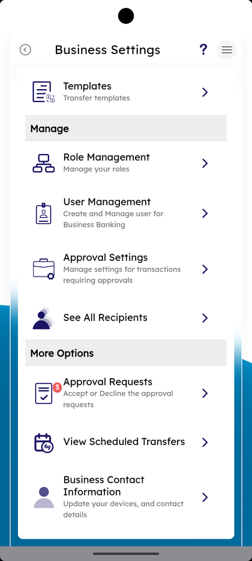
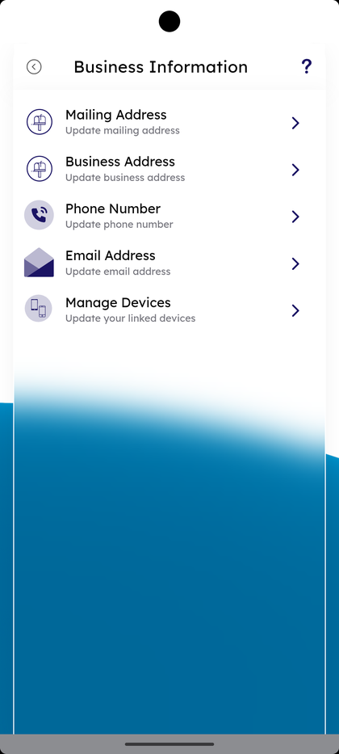
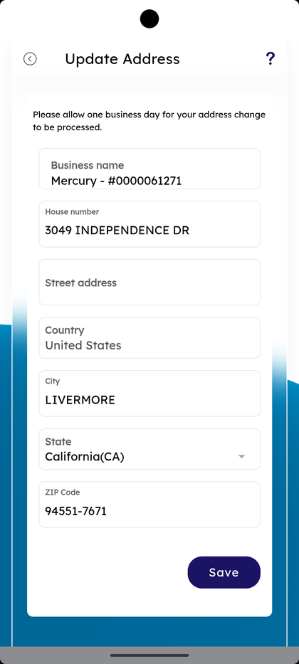
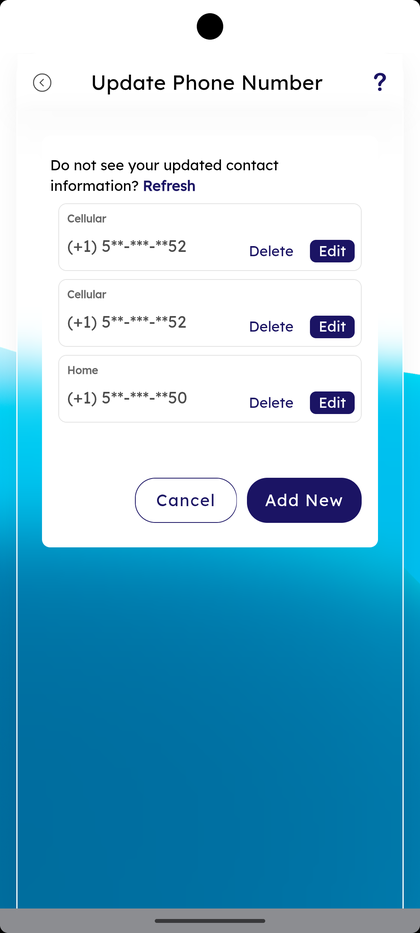
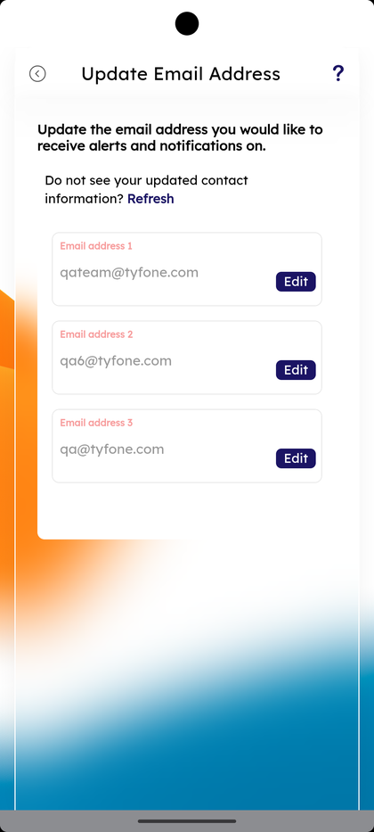
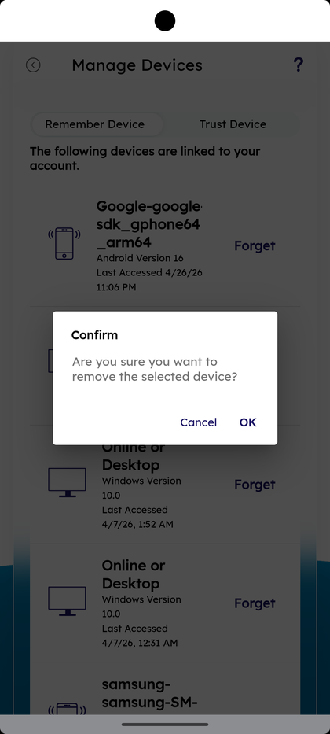

# Business Contact Information

_Summerville Mobile › Business Banking › Business Information_

## Business Banking: Business Contact Information

> The Business Information menu — Mailing Address, Business Address, Phone Number, Email Address, and Manage Devices — for updating the contact information on file for the business profile. Same per-row Edit + Add New + Delete pattern used in personal Settings, plus a Refresh hint when contact info hasn't propagated.

**How to get here:** Side Menu (☰) → **Business Settings** → **Business Contact Information**

### Step-by-Step Workflow

#### Step 1: Open Business Settings → Business Contact Information

From Side Menu (☰) → **Business Settings**, scroll to **More Options** and tap **Business Contact Information — Update your devices, and contact details**. The **Business Information** menu opens.

#### Step 2: Pick the Field to Update

The Business Information menu lists five rows: **Mailing Address — Update mailing address**, **Business Address — Update business address**, **Phone Number — Update phone number**, **Email Address — Update email address**, and **Manage Devices — Update your linked devices**.

#### Step 3: Update an Address

Tap **Business Address** or **Mailing Address**. The **Update Address** screen opens with the helper *"Please allow one business day for your address change to be processed."* and the editable fields **Business name**, **House number**, **Street address**, **Country**, **City**, **State**, **ZIP Code**. Tap **Save**.

#### Step 4: Update Phone Number

Tap **Phone Number**. The **Update Phone Number** sheet opens with each phone on file (Cellular, Home) shown in masked form, an inline **Delete** and **Edit** per row, the helper *"Do not see your updated contact information? Refresh"*, and **Add New** + **Cancel** at the bottom.

#### Step 5: Update Email Address

Tap **Email Address**. The **Update Email Address** screen opens with the helper *"Update the email address you would like to receive alerts and notifications on."* and the *"Do not see your updated contact information? Refresh"* hint. Each email row has an **Edit** button.

#### Step 6: Manage Devices and Confirm Forget

Tap **Manage Devices**. The **Manage Devices** screen has the **Remember Device** / **Trust Device** tabs and *"The following devices are linked to your account."* with each device listed (Android Version, last accessed timestamp). Tap **Forget** on any row — a **Confirm** dialog asks *"Are you sure you want to remove the selected device?"* with **Cancel** and **OK**.

### Summary

Business Contact Information is the same shape as the personal Settings → Personal Information menu but scoped to the business profile. The Refresh hint pulls fresh core data when a branch update hasn't propagated yet. Manage Devices on the business profile controls which devices can authenticate into the business — the Forget Confirm dialog is the guardrail. Address edits carry the *"one business day"* processing notice because the change touches statements and regulatory contact records.

### Key Use Cases

* Business moves office: **Mailing Address** or **Business Address** → update fields → **Save**.
* New business landline: **Phone Number** → **Add New** → save the new number.
* Move alert delivery to a new email: **Email Address** → **Edit** the row → save.
* Lost phone with the business app installed: **Manage Devices** → **Forget** the device → **OK** in the Confirm dialog.
