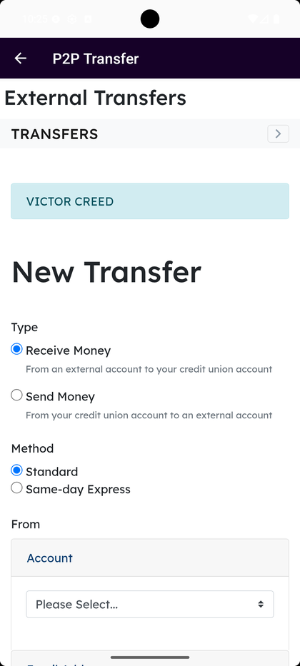
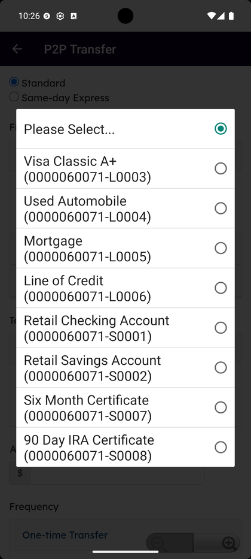

# P2P Transfer (Business)

_Summerville Mobile › Business Banking › P2P Transfer_

## Business Banking: P2P Transfer

> The P2P Transfer form for moving funds between an external account and a business credit union account. Pick Type (Receive / Send), Method (Standard / Same-day Express), the From account, the amount, Frequency (One-time or Recurring), and optional Personal Notes.

**How to get here:** Side Menu (☰) → **Business Settings** → **P2P Transfer**

### Step-by-Step Workflow

#### Step 1: Open Business Settings → P2P Transfer

From Side Menu (☰) → **Business Settings**, tap **P2P Transfer**. The **P2P Transfer** screen opens under the heading **External Transfers — TRANSFERS** with the active recipient listed and a **New Transfer** form below.

#### Step 2: Pick Type

Under **Type** pick **Receive Money** (*"From an external account to your credit union account"*) or **Send Money** (*"From your credit union account to an external account"*).

#### Step 3: Pick Method

Under **Method** pick **Standard** or **Same-day Express**. Same-day Express settles faster but at a higher cost.

#### Step 4: Pick the From Account

Under **From — Account**, tap **Please Select…**. The list shows every credit union product (e.g., Visa Classic, Used Automobile, Mortgage, Line of Credit, Retail Checking Account, Retail Savings Account, Six Month Certificate, 90 Day IRA Certificate) — pick the one to debit or credit.

#### Step 5: Enter Amount

Scroll to **Amount** and type the dollar value. Tap **Advanced Options** for additional fields if needed.

#### Step 6: Pick Frequency — One-time

Under **Frequency**, **One-time Transfer** is the default. Pick a **Transfer Date** from the inline calendar — *"Transfer will complete By:"* updates with the settlement window.

#### Step 7: Pick Frequency — Recurring Transfer

Tap **Recurring Transfer** to switch. Pick a **First Transfer Date**, then under **Recurrence** pick **Weekly** (with **Day** + **Every X week(s)**), **Monthly** (with **Day** + **Every X month(s)**), **Semi-monthly** (*"15th and the last day of the month"*), or **End of month**.

#### Step 8: Pick End Transfer

Under **End Transfer** pick **No end date**, **Specific Date**, or **After X occurrences**. Add **Personal Notes** if needed and submit.

### Summary

P2P Transfer moves funds between an external account and any credit union account in one form — pick the right Type so the direction is clear, and the right Method based on how fast it has to land. The Recurrence + End Transfer pair turns one form into a long-running schedule with a hard stop. Personal Notes carry context across to the schedule view.

### Key Use Cases

* Move money from a personal external account into the business checking: **Type — Receive Money**, **Method — Standard**.
* Pay an external account from a credit union account today: **Type — Send Money**, **Method — Same-day Express**.
* Recurring transfer twice a month: **Recurring Transfer** → **Semi-monthly**, **End Transfer — No end date** until cancelled.
* Limited-run plan: **Recurring Transfer** → **Weekly**, **End Transfer — After 12 occurrences**.
