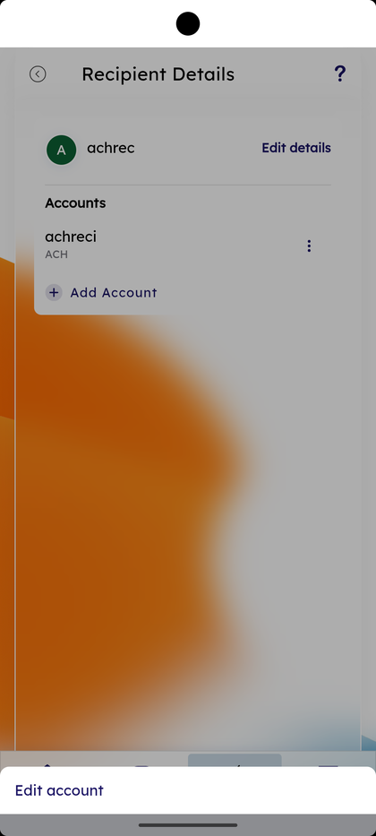

# Recipient Management

_Summerville Mobile › Business Banking › See All Recipients (Recipient Management)_

## Business Banking: See All Recipients

> The Manage Recipients hub showing **Individual** and **Business Payee** categories, the **All Recipients** list with **+ New** to add, **Copy Recipients…** to share recipients across businesses, and a long-press sheet with **Edit** and **Remove**. Each recipient opens a Recipient Details page with **Edit details** and **Add Account**.

**How to get here:** Side Menu (☰) → **Business Settings** → **See All Recipients**

### Step-by-Step Workflow

#### Step 1: Open Business Settings → See All Recipients

From Side Menu (☰) → **Business Settings**, scroll to **Manage** and tap **See All Recipients**. The **Manage Recipients** screen opens.

#### Step 2: Pick Individual or Business Payee

The Manage Recipients screen lists the categories under **Individual** with **Business Payee** as a row. Tap **Business Payee** to filter to business recipients only.

#### Step 3: Review All Recipients

The **All Recipients** screen shows **Business recipient** with **+ New** at the top right, the **Business Name — #membership** card, a **Copy Recipients…** link, and a list under **Recipients under business** with a count of accounts per recipient and a 3-dot menu per row.

#### Step 4: Long-Press for Edit or Remove

Long-press a recipient row. A bottom sheet opens with **Edit** and **Remove**. Edit re-opens the recipient form; Remove deletes the recipient from the business.

#### Step 5: Open Recipient Details

Tap a recipient. The **Recipient Details** screen shows the recipient initial avatar, name, **Edit details** link, and **Accounts** with the account row and an inline 3-dot menu. **+ Add Account** sits below the list and **Edit account** at the bottom.

#### Step 6: Add an Account

Tap **+ Add Account**. The **Add Account** sheet opens with **Payment type** (e.g., **Within Summerville**), **Membership**, **Enter first name (optional)**, **Enter last name**, **Recipient Nickname**, **Enter account type**, and **Enter account number**. Tap **Add Recipient** to save.

#### Step 7: Copy Recipients to Other Businesses

On All Recipients tap **Copy Recipients…**. The **Copy Recipients** wizard opens with **STEP 1 → STEP 4** progress at the top and the helper *"Select the businesses to which you want the recipients to be copied"* — tick **Select All Business** or individual business rows, then **Next**.

#### Step 8: Receive the New-Recipient Alert

After adding an external recipient, a Summerville push appears: *"An external account ending in *******45 with <recipient> at <institution> has been added as an account for funds transfer in your Summerville Digital Banking."* Read and dismiss.

### Summary

Recipient Management is the source of truth for who the business can send money to. **+ New** adds a recipient; **Add Account** attaches another account under that recipient (a vendor with multiple receiving accounts). **Copy Recipients…** is the time-saver for businesses with multiple memberships — instead of recreating recipients per business, copy the list across in one wizard. Long-press → Edit / Remove keeps the list clean. Every external add fires a Summerville alert as a security signal.

### Key Use Cases

* Add a new vendor with one ACH account: **+ New** under Business Payee → **Add Recipient**.
* Vendor has both a checking and a savings receiving account: open the recipient → **+ Add Account** for the second one.
* Onboarding a second business under the same admin: **Copy Recipients…** → tick the new business → finish the wizard.
* Vendor changed their bank: long-press the row → **Edit** to update the account, or **Remove** the old recipient and re-add.
