# Recipient Management

_Summerville Mobile › Business Banking › See All Recipients (Recipient Management)_

## Business Banking: See All Recipients

> The Manage Recipients hub showing **Individual** and **Business Payee** categories, the **All Recipients** list with **+ New** to add (a 3-step wizard), **Copy Recipients…** to share recipients across businesses (a 4-step wizard), and a long-press sheet with **Edit** and **Remove**. Each recipient opens a Recipient Details page with **Edit details**, **Add Account**, and **Update Account**.

**How to get here:** Side Menu (☰) → **Business Settings** → **See All Recipients**

### Step-by-Step Workflow

#### Step 1: Open Business Settings → See All Recipients

From Side Menu (☰) → **Business Settings**, scroll to **Manage** and tap **See All Recipients**. The **Manage Recipients** screen opens.

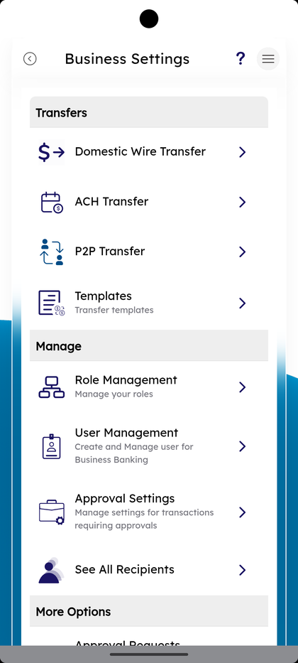

#### Step 2: Pick Individual or Business Payee

The Manage Recipients screen lists the categories under **Individual** with **Business Payee** as a row. Tap **Business Payee** to filter to business recipients only.

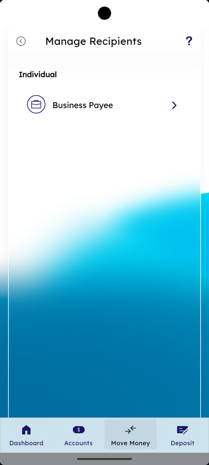

#### Step 3: Review All Recipients

The **All Recipients** screen shows **Business recipient** with **+ New** at the top right, the business card, a **Copy Recipients…** link, and a list under **Recipients under business** with a count of accounts per recipient and a 3-dot menu per row.

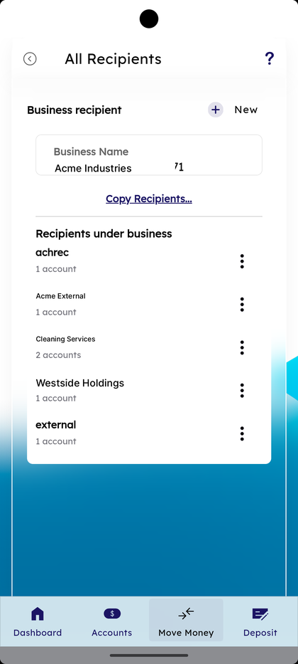

#### Step 4: Long-Press for Edit or Remove

Long-press a recipient row. A bottom sheet opens with **Edit** and **Remove**. Edit re-opens the recipient form; Remove deletes the recipient from the business.

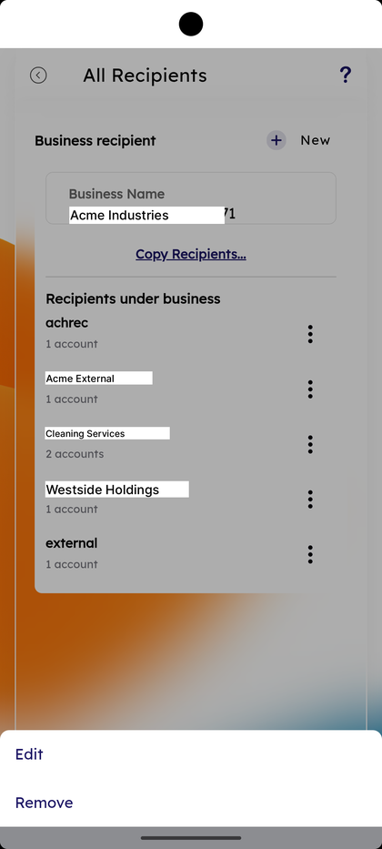

#### Step 5: Open Recipient Details

Tap a recipient. The **Recipient Details** screen shows the recipient avatar, name, **Edit details** link, and **Accounts** with each account row and an inline 3-dot menu.

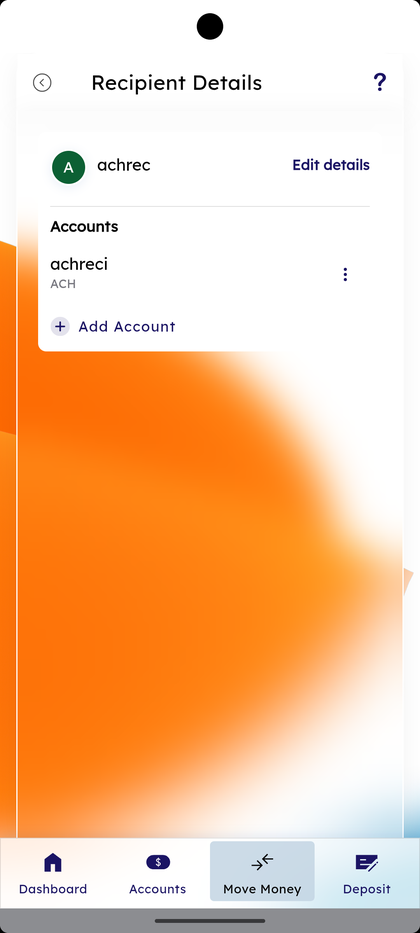

#### Step 6: Tap Edit details

Tap **Edit details**. The **Edit recipient details** sheet opens with **Enter account holder's name** pre-filled. Update and tap **Save Changes**, or **Cancel** to discard.

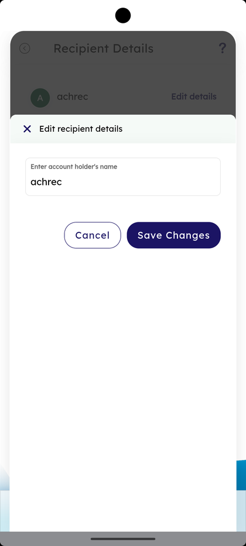

#### Step 7: Recipient Updated Successfully

After Save Changes the **Edit Recipient** dialog shows *"Recipient updated successfully."* with the recipient row card and **OK** to dismiss. A Summerville Mobile Banking notification chip appears at the top.

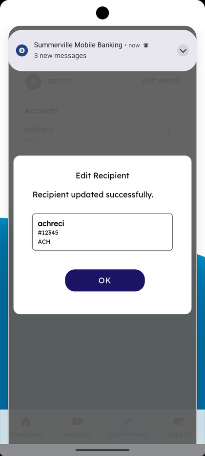

#### Step 8: Open the Account 3-dot Menu — Update Account

Tap the 3-dot menu on an account row to open **Update Account**. The form shows **Payment type** (e.g., **External**), **Name on account** (in green), **External Account Nickname**, **Account number**, **Account type**, **Routing number**, the receiving institution name (e.g., *"STAR ONE CREDIT UNION"*), and a **Save** button.

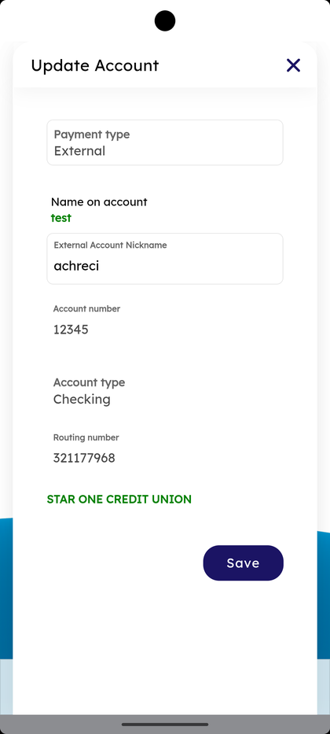

#### Step 9: Confirm External Account on Save

After Save, a **Confirm External Account** sheet appears: *"Please confirm the details to add the external account"* with **Account Holder Name**, **Account Number**, **External Account Nickname**, and **Edit** / **Save** buttons. Tap **Save** to commit or **Edit** to fix.

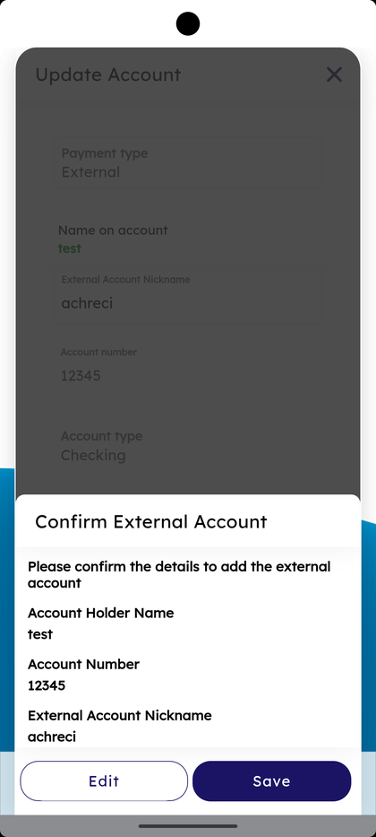

#### Step 10: Receive the External Recipient Alert

A Summerville push appears: *"An external account ending in *******45 with <recipient> at <institution> has been added as an account for funds transfer in your Summerville Digital Banking."* Read and dismiss.

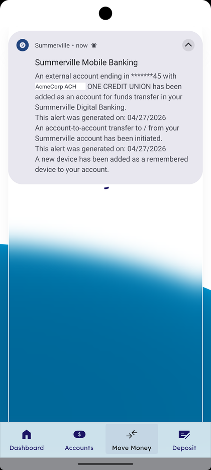

#### Step 11: Tap + Add Account on a Recipient

On Recipient Details, tap **+ Add Account**. The **Add Account** sheet opens with **Payment type** (e.g., **Within Summerville**), **Membership**, **Enter first name (optional)**, **Enter last name**, **Recipient Nickname**, **Enter account type**, and **Enter account number**.

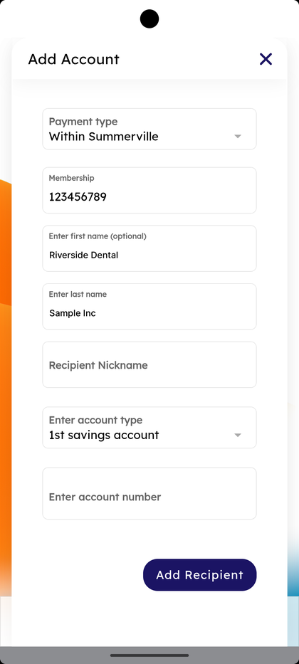

#### Step 12: Pick Account Type

Tap **Enter account type**. Seven options appear: **1st savings account**, **1st checking account**, **Other savings account**, **Other checking account**, **Loan account**, **LOC account**, **Credit Card account**.

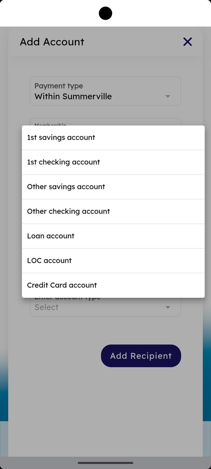

#### Step 13: Tap Add Recipient and Confirm

Fill the form and tap **Add Recipient**. A **Confirm Recipient** sheet appears: *"Please confirm the details to add the recipient"* with **Customer ID**, **First Name**, **Last Name**, **Recipient Nickname**, and **Edit** / **Save** buttons. Tap **Save** to commit.

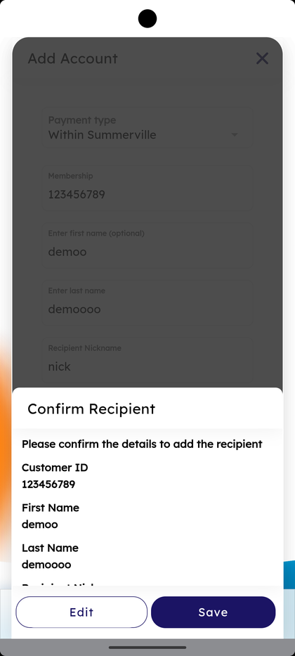

#### Step 14: Open Add Recipient Wizard — Step 1

On All Recipients, tap **+ New**. The **Add Recipient** wizard opens at **STEP 1** with the **Business** card and **Next** to advance.

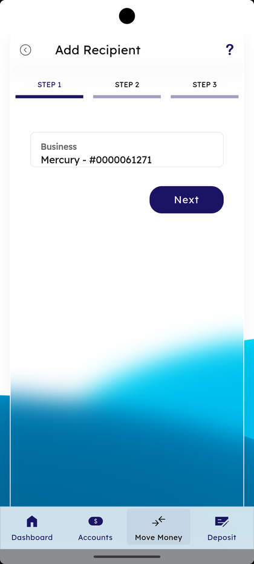

#### Step 15: Add Recipient — Step 2 — Recipient Details

**STEP 2** shows **Recipient Details** with a **Recipient Name** field. Type a name and tap **Next**, or **Cancel** to abandon.

#### Step 16: Open Copy Recipients — Step 1

Back on All Recipients, tap **Copy Recipients…**. The wizard opens at **STEP 1** with **Select the business from which you want to copy** and the source business card. Tap **Next**.

#### Step 17: Copy Recipients — Step 2 — Pick Recipients

**STEP 2** shows the helper *"Recipient accounts pending verification via pre-notes cannot be copied. Please wait until the account is verified or create a new recipient in the other business."* Below is **Select All Recipients** plus a per-recipient checkbox list with pagination (e.g., **1 to 5 of 5**) and **Next** / **Previous**.

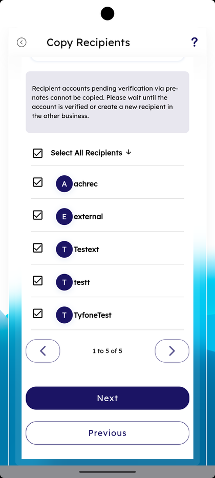

#### Step 18: Copy Recipients — Step 3 — Pick Target Businesses

**STEP 3** shows *"Select the businesses to which you want the recipients to be copied"* with **Select All Business** and per-business checkboxes. Tap **Next**.

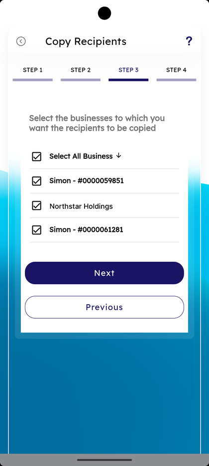

#### Step 19: Copy Recipients — Step 4 — Review

**STEP 4** shows *"Copying N recipients from <source> to M other businesses…"* with each target business listed and *"N Recipient(s) will be added. Show"*. Tap **Confirm** to proceed.

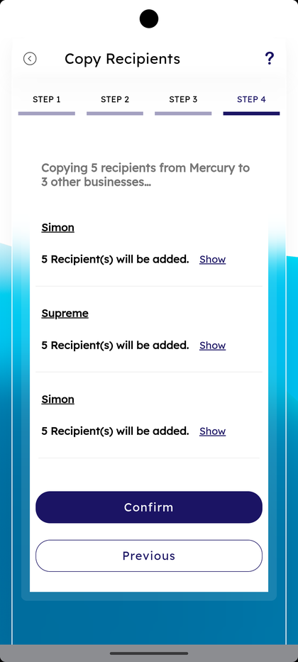

#### Step 20: Show Per-Business Recipient List

Tap **Show** on any target business. The list expands inline with each recipient avatar and name, plus an **×** to remove. Tap **Hide** to collapse.

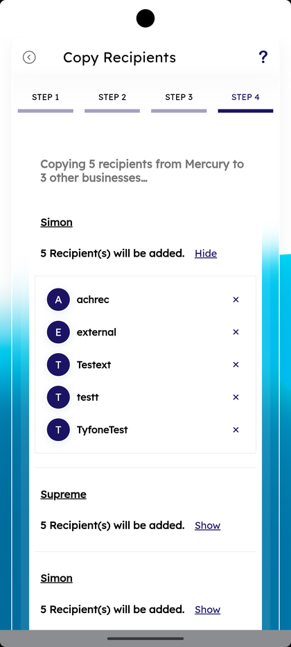

#### Step 21: Confirm the Copy

Tap **Confirm** at the bottom. A **Confirm** dialog appears: *"Are you sure you want to copy recipients from <source> to N other businesses?"* with **Cancel** and **OK**. Tap **OK** to commit.

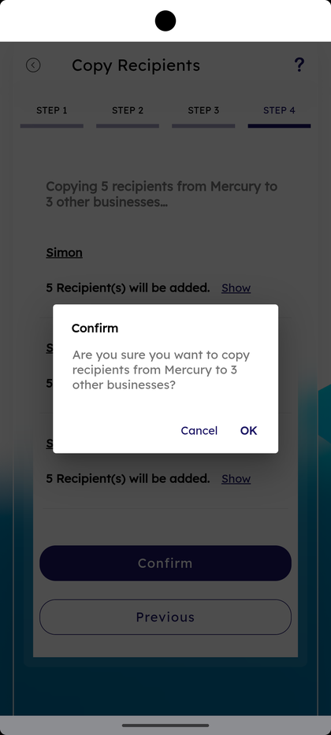

### Summary

Recipient Management is the source of truth for who the business can send money to. **+ New** runs a 3-step wizard to add a recipient; **Add Account** attaches another account under that recipient. Editing a recipient or its account opens a Confirm sheet before save, and external adds fire a Summerville alert as a security signal. **Copy Recipients…** is the time-saver for businesses with multiple memberships — instead of recreating recipients per business, the 4-step wizard tickets which recipients copy and which target businesses receive them, with a final Confirm dialog. Long-press → Edit / Remove keeps the list clean.

### Key Use Cases

* Add a new vendor with one ACH account: **+ New** under Business Payee → fill the wizard → **Add Recipient** → **Save** in Confirm Recipient.
* Vendor has both a checking and a savings receiving account: open the recipient → **+ Add Account** for the second one.
* Vendor changed their bank: open the recipient → 3-dot menu → **Update Account** → fix the routing/account → **Save** → **Save** in Confirm External Account.
* Onboarding a second business under the same admin: **Copy Recipients…** → tick recipients → tick target businesses → review → **OK** in Confirm.
* Renaming a recipient on file: open the recipient → **Edit details** → update name → **Save Changes** → **OK** on success.
