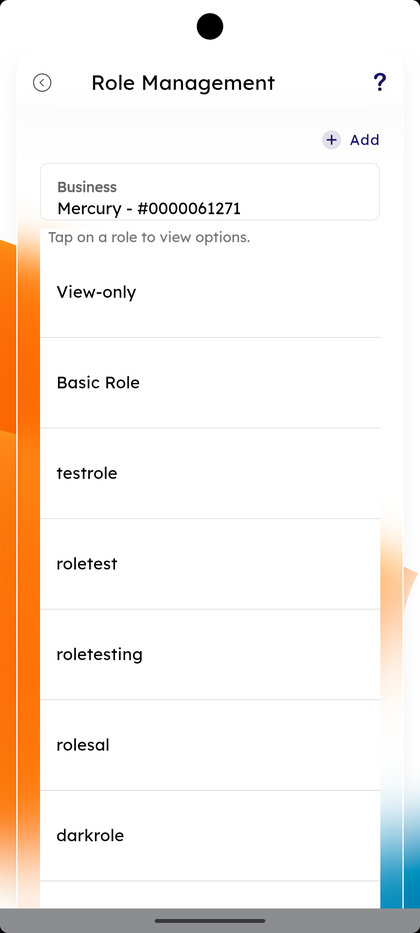
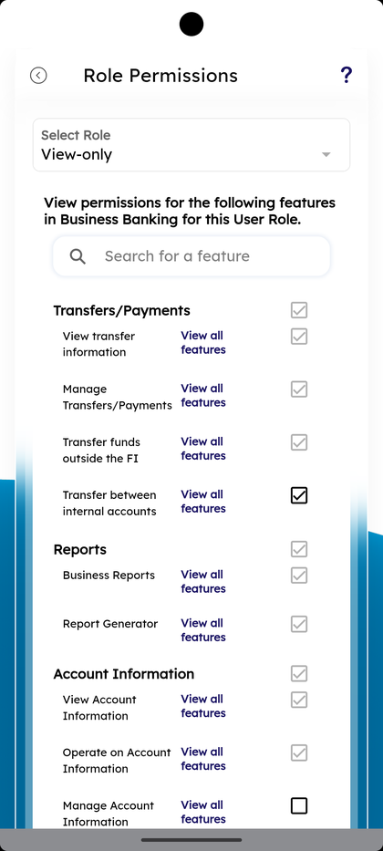
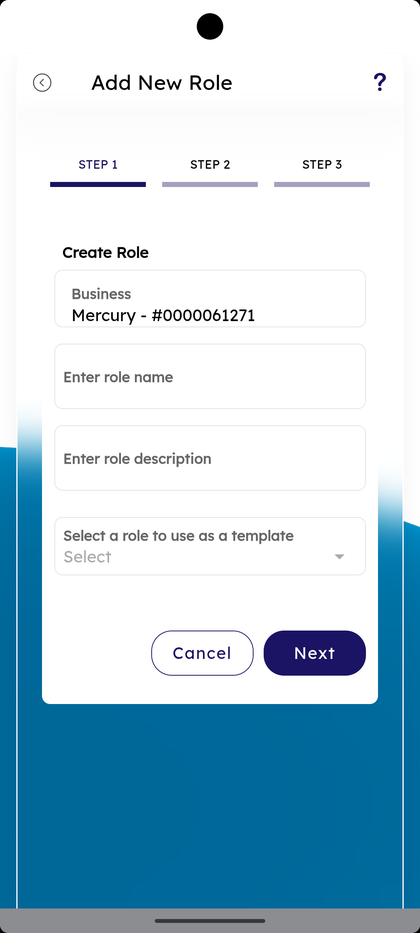
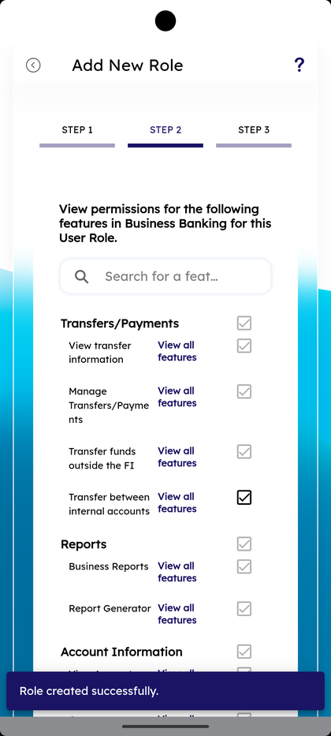

# Role Management

_Summerville Mobile › Business Banking › Role Management_

## Business Banking: Role Management

> The Role Management screen — every named role on the business (built-in and custom) with **+ Add** to create new ones. Tapping a role opens **Role Permissions** with category-grouped feature checkboxes. **Add New Role** is a 3-step wizard: name + description + template, then permissions, then review.

**How to get here:** Side Menu (☰) → **Business Settings** → **Role Management**

### Step-by-Step Workflow

#### Step 1: Open Business Settings → Role Management

From Side Menu (☰) → **Business Settings**, scroll to **Manage** and tap **Role Management — Manage your roles**. The **Role Management** screen opens with **+ Add** at the top right and the helper *"Tap on a role to view options."*

#### Step 2: Review the Role List

The screen shows the active business and a list of roles (e.g., **View-only**, **Basic Role**, plus any custom roles created by the admin). Each row is tappable to view its permissions.

#### Step 3: Open Role Permissions

Tap a role. The **Role Permissions** screen opens with **Select Role** at the top, the helper *"View permissions for the following features in Business Banking for this User Role"*, and a feature-search field above category-grouped permissions.

#### Step 4: Review Permission Categories

Permissions are grouped: **Transfers/Payments** (View transfer information, Manage Transfers/Payments, Transfer funds outside the FI, Transfer between internal accounts), **Reports** (Business Reports, Report Generator), and **Account Information** (View Account Information, Operate on Account Information, Manage Account Information). Each item has a **View all features** link and a tickbox.

#### Step 5: Tap + Add to Create a Role — Step 1

Back on Role Management tap **+ Add**. The **Add New Role** wizard opens at **STEP 1** with **Create Role — Business**, **Enter role name**, **Enter role description**, and **Select a role to use as a template**. Fill in and tap **Next**.

#### Step 6: Step 2 — Set Permissions

**STEP 2** repeats the *"View permissions for the following features in Business Banking for this User Role"* layout. Tick the features the role should have under **Transfers/Payments**, **Reports**, **Account Information**, and any further categories.

#### Step 7: Save the Role

Save the role at the end of the wizard. A success bar appears: *"Role created successfully."*

### Summary

Role Management is the permission layer of business banking — define what a role can do once, then attach the role to users in User Management. The **Select a role to use as a template** option in Add New Role is the shortcut for variants on an existing role (e.g., a stricter Basic Role with no external transfers). The "Role created successfully" bar confirms the wizard committed before you navigate away.

### Key Use Cases

* Create a transfer-approver role: **+ Add** → name *Transfer Approver* → tick Transfers/Payments features only.
* Create a read-only reporting role: name *Reporting* → leave Transfers off, tick Reports.
* Audit what a role can do today: tap the role → review the ticked permissions on Role Permissions.
* Quickly clone an existing role: in **Step 1** pick the source role under **Select a role to use as a template**, then change a single category in **Step 2**.
