# Role Management

_Summerville Mobile › Business Banking › Role Management_

## Business Banking: Role Management

> The Role Management screen — every named role on the business with **+ Add** to create new ones. Long-press a role for a 4-action sheet (**Settings**, **Permissions**, **Limits**, **User in Role**). **Role Setting** edits name/description and toggles active status. **Role Permissions** is a category-grouped feature checkbox list. **Role Limit** sets per-feature caps with Daily / Monthly / Per Transaction limit types. **Add New Role** is a 3-step wizard: name + template, permissions, limits.

**How to get here:** Side Menu (☰) → **Business Settings** → **Role Management**

### Step-by-Step Workflow

#### Step 1: Open Business Settings → Role Management

From Side Menu (☰) → **Business Settings**, scroll to **Manage** and tap **Role Management — Manage your roles**. The **Role Management** screen opens with **+ Add** at the top right and the helper *"Tap on a role to view options."*

#### Step 2: Review the Role List

The screen shows the active business and a list of roles (e.g., **View-only**, **Basic Role**, plus any custom roles). Each row is tappable for quick options.

#### Step 3: Long-Press a Role for the Action Sheet

Long-press any role row. A bottom sheet opens with four actions: **Settings**, **Permissions**, **Limits**, **User in Role**.

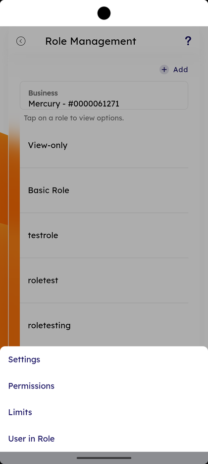

#### Step 4: Tap Settings — Role Setting Screen

Pick **Settings**. The **Role Setting** screen shows **Select Role** dropdown, **Role Status** (Active), **Role Name**, **Role Description**, and two buttons — **Edit Role Information** and **Deactivate**.

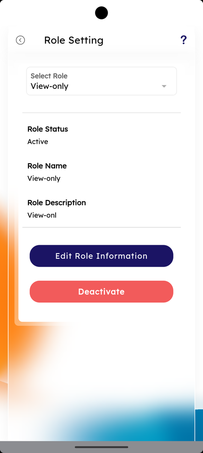

#### Step 5: Switch Role from the Dropdown

Tap **Select Role**. A scrollable list of every role in the business appears (View-only, Basic Role, testrole, roletest, roletesting, rolesal, darkrole, etc.). Pick one to load its settings.

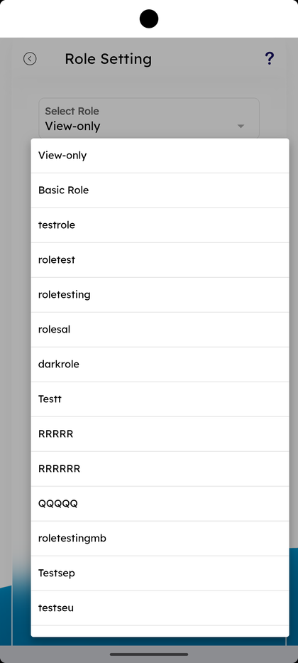

#### Step 6: Open Role Permissions

From the long-press sheet pick **Permissions**, or open Role Permissions directly. The screen shows category-grouped feature checkboxes: **Transfers/Payments** (View transfer information, Manage Transfers/Payments, Transfer funds outside the FI, Transfer between internal accounts), **Reports** (Business Reports, Report Generator), **Account Information** (View Account Information, Operate on Account Information, Manage Account Information). Each item has a **View all features** link and a tickbox.

#### Step 7: Review the Full Permission Categories

Scroll the Role Permissions list. Additional categories include **Settings** (Personal Settings, View Business Settings, Manage Business Settings), **Alerts** (Enable alerts), **Support** (Tickets), **Approvals** (Approve/decline requests, View approvals), **Banking Services** (Services). The footer note reads *"Please ensure the user(s) is set up on other necessary systems, so they may effectively access all digital banking features."*

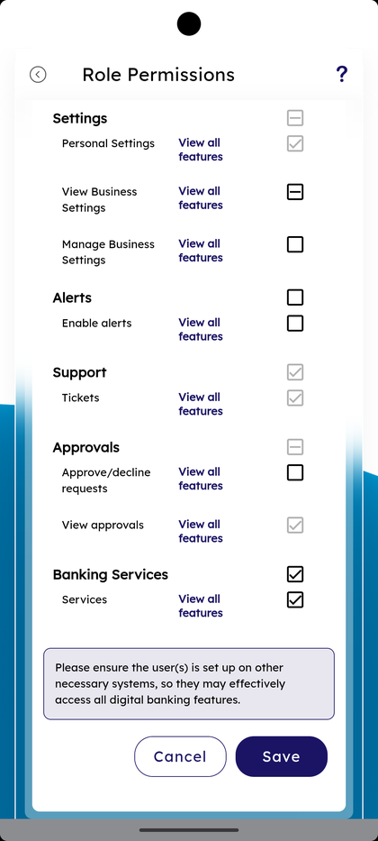

#### Step 8: Save Permissions

Tap **Save** at the bottom. A success bar appears: *"Role Permission has been updated successfully."*

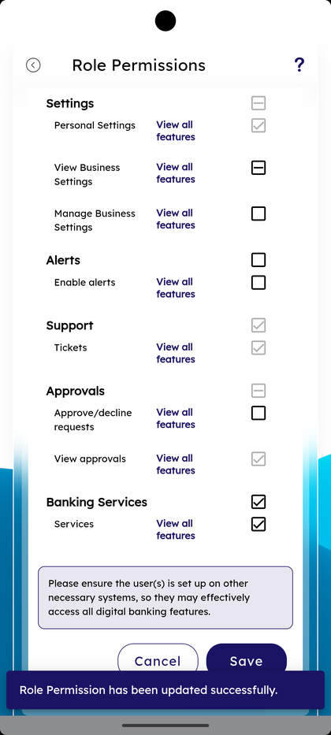

#### Step 9: Open Role Limit

From the long-press sheet pick **Limits**. The **Role Limit** screen shows **Select Role** at the top and a list of limit-eligible features — **Request ACH collections**, **Run payroll template(s) via ACH**, **Make domestic wire transfers**, **Make ACH payments** — each with **Add Limit**.

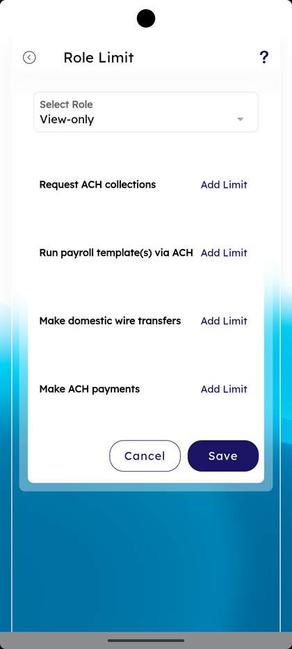

#### Step 10: Tap Add Limit on a Feature

Tap **Add Limit** on a feature row (e.g., *Request ACH collections*). The feature sheet opens with **Amount limits** and **Add Limit** plus **Cancel** / **Save Limit** buttons.

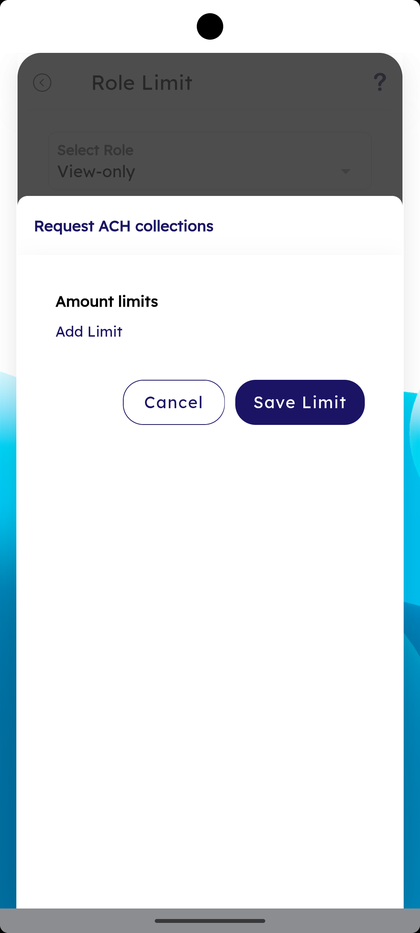

#### Step 11: Pick a Limit Type

Tap **Select Limit Type**. Three options appear: **Daily Limit**, **Monthly Limit**, **Per Transaction**. Pick one and enter the dollar value.

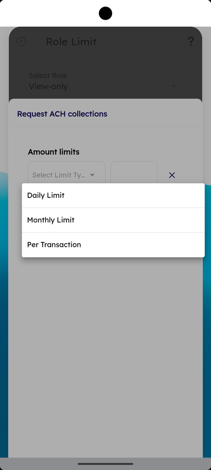

#### Step 12: Save Limit

Save the limit. The Role Limit screen shows the feature now with **Edit Limits**, **Amount Limit**, the picked limit type and value (e.g., **Daily Limit — $10.00**). A success bar reads *"Role limit updated successfully."*

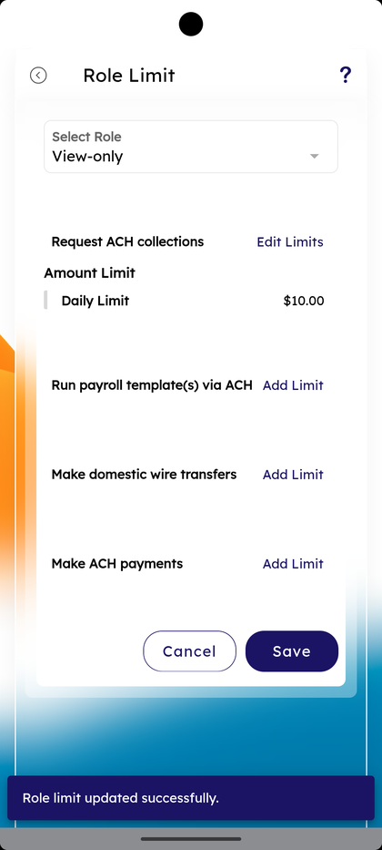

#### Step 13: Tap User in Role — User Management View

From the long-press sheet pick **User in Role**. The **User Management** screen opens scoped to the role, showing every user grouped by their role.

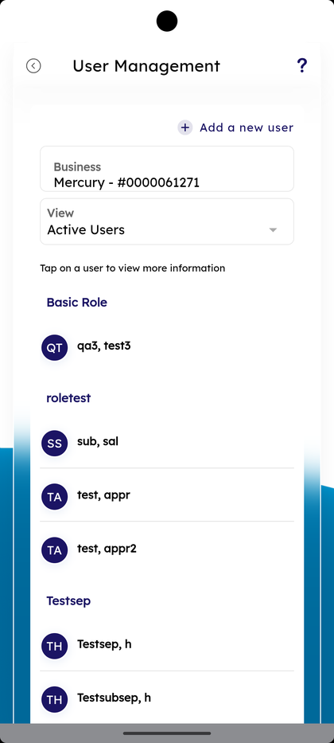

#### Step 14: Open User Information from the Role View

Tap a user row. The **User Information** screen opens with the user avatar, name, **Email ID**, **Phone Number**, **Business**, **This user is associated with**, and a **User Role** card with **View role privileges** and **Account access**.

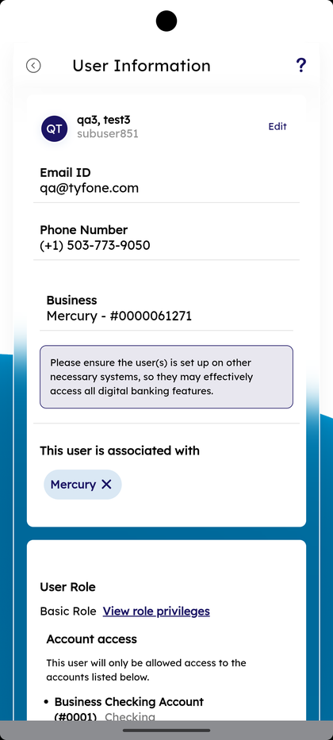

#### Step 15: Tap + Add a New User — Invite Sub User

From User Management, tap **+ Add a new user**. The **Invite Sub User** form opens with email, **Country Code**, **Phone Number**, **Please provide the following: Assign role** dropdown, **View Role Privileges**, the *"Please ensure the user(s) is set up on other necessary systems"* helper, **Select account access for this user**, and **Add User**.

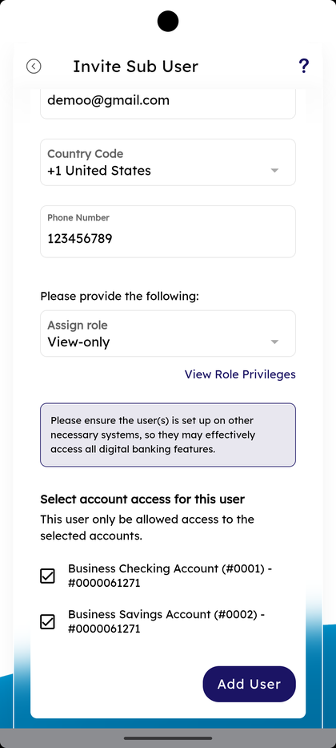

#### Step 16: Pick the Assign Role

Tap **Assign role**. The list shows every role (View-only, Basic Role, testrole, roletest, roletesting, rolesal, darkrole, Testt, Testsep). Pick one to attach to the new user.

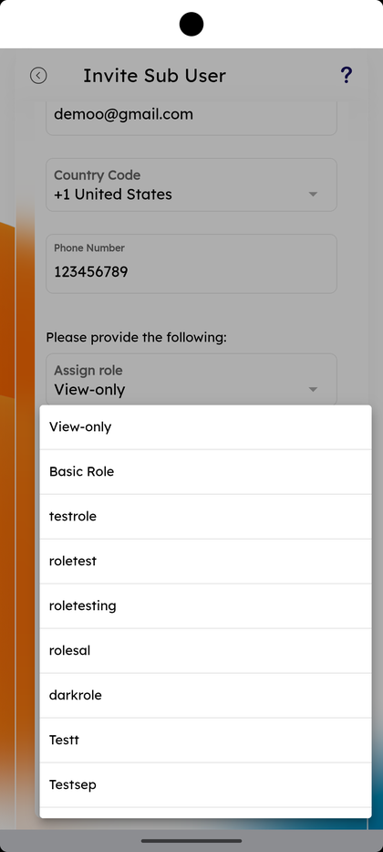

#### Step 17: Open Add New Role Wizard — Step 1

Back on Role Management tap **+ Add**. The **Add New Role** wizard opens at **STEP 1** with **Create Role — Business**, **Enter role name**, **Enter role description**, and **Select a role to use as a template**.

#### Step 18: Pick a Template Role

Tap **Select a role to use as a template**. The list shows every existing role to clone permissions from. Pick one and tap **Next**.

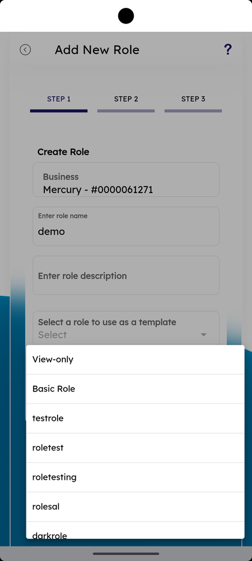

#### Step 19: Add New Role — Step 2 — Permissions

**STEP 2** repeats the *"View permissions for the following features in Business Banking for this User Role"* layout. Tick the features under **Transfers/Payments**, **Reports**, **Account Information**, etc.

#### Step 20: Add New Role — Step 3 — Limits

**STEP 3** opens the Role Limit summary for the new role with **Request ACH collections**, **Run payroll template(s) via ACH**, **Make domestic wire transfers**, **Make ACH payments** — each with **Add Limit** or pre-filled values (e.g., **Daily Limit — $10.00**) and **Edit Limits**. Tap **Save**. A success bar reads *"Role Permission has been updated successfully."*

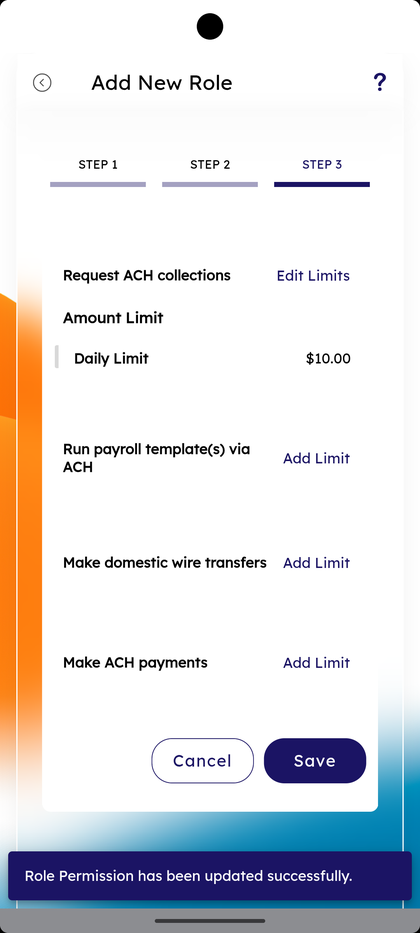

### Summary

Role Management is the permission and limit layer of business banking — define what a role can do once, then attach the role to users in User Management or via Invite Sub User. **Settings** holds the role's name, description, and active status. **Permissions** is the category-grouped feature checkboxes covering Transfers, Reports, Account Information, Settings, Alerts, Support, Approvals, and Banking Services. **Limits** caps the dollar amount per feature with Daily / Monthly / Per Transaction limit types. **User in Role** jumps to the User Management view scoped to that role. The Add New Role wizard combines all three (template, permissions, limits) in one flow.

### Key Use Cases

* Create a transfer-approver role: **+ Add** → name *Transfer Approver* → tick Transfers/Payments features only → set limits → save.
* Cap daily ACH on a clerical role: long-press → **Limits** → **Make ACH payments** → **Add Limit** → **Daily Limit — $5,000** → Save.
* Audit who's in a role today: long-press → **User in Role**.
* Quickly clone an existing role with a slight variation: **+ Add** → pick **Select a role to use as a template** → adjust one category in Step 2.
* Deactivate an unused role: long-press → **Settings** → **Deactivate**.
