# Transfer Templates

_Summerville Mobile › Business Banking › Transfer Templates_

## Business Banking: Transfer Templates

> The Templates list — every saved transfer setup the business has, filtered by payment type (ACH / Domestic Wire) and template type (Payments / Collections / Payroll). Long-press a template for **Run / Detail / Edit / Duplicate / Remove**. **Run Template** picks an Effective date and runs through OTP verification to a success dialog. **+ Create a template** opens a wizard with payment type, template type, sec code, company entry description, sender, recipient(s), and Save Template confirm.

**How to get here:** Side Menu (☰) → **Business Settings** → **Templates**

### Step-by-Step Workflow

#### Step 1: Open Business Settings → Templates

From Side Menu (☰) → **Business Settings**, tap **Templates — Transfer templates**. The **Templates** screen opens with the business name at the top.

#### Step 2: Review the List

The page has two dropdowns under the business header — payment type (defaulted to **ACH**) and template type (defaulted to **Payments**). The list below shows each template with **Type: Payments**, **Recipients: N**, and **Type: PPD / CCD / WEB**. **+ Create a template** sits at the top right.

#### Step 3: Filter by Payment Type

Tap the payment type dropdown. Two options: **ACH** and **Domestic Wire**.

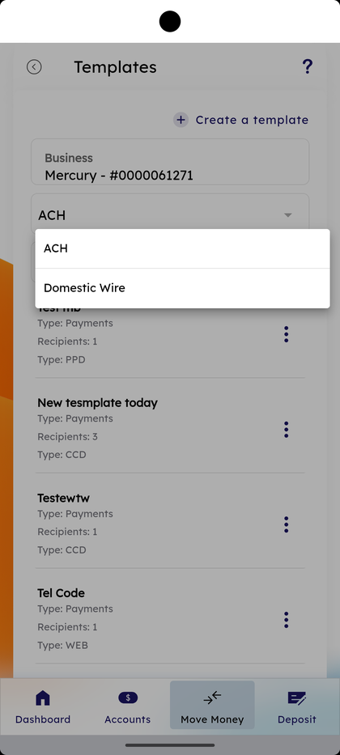

#### Step 4: Filter by Template Type

Tap the template type dropdown. Three options: **Payments**, **Collections**, **Payroll**.

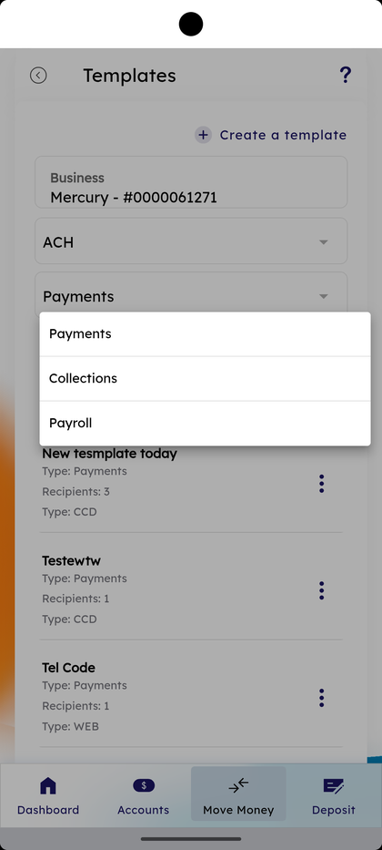

#### Step 5: Long-Press a Template

Long-press any template row. A bottom sheet opens with five actions: **Run**, **Detail**, **Edit**, **Duplicate**, **Remove**.

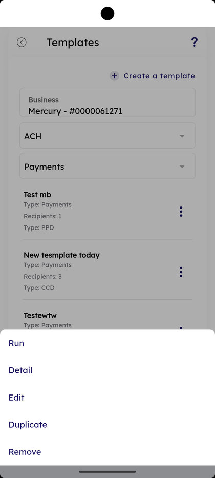

#### Step 6: Tap Run — Open Run Template

Pick **Run** from the long-press sheet (or tap the row). The **Run Template** screen opens showing the template name, **Payment type — ACH (PPD)**, **Template Type — Payments**, the **Sender** business account with **Available balance**, the **Recipient** row with the masked account, **Total amount**, **Company Entry Description**, and **Effective date**.

#### Step 7: Pick the Effective Date

Tap the **Effective date** calendar and use the month/day/year wheel. The default is the next available business date.

#### Step 8: Tick Repeat or Edit Recipient

A long-press on the Recipient row opens an **Edit** sheet at the bottom. Below the calendar there's an optional **Repeat** tick to schedule the template to re-run.

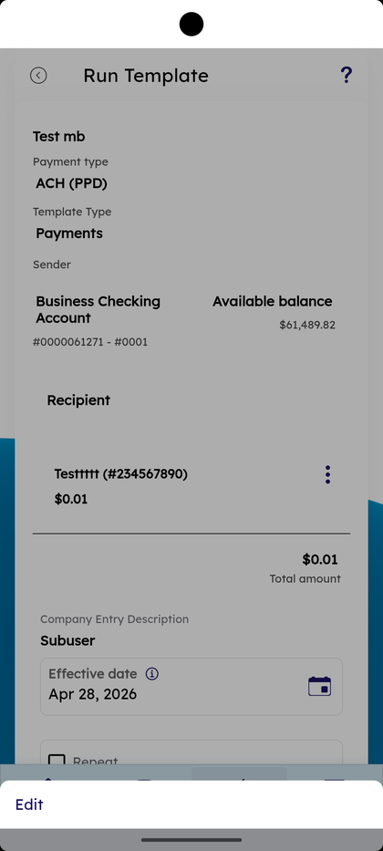

#### Step 9: Tap Run Template and Confirm

Tap **Run Template** at the bottom. A **Confirm** dialog appears: *"Are you sure you want to run template <name>?"* with **Cancel** and **OK**.

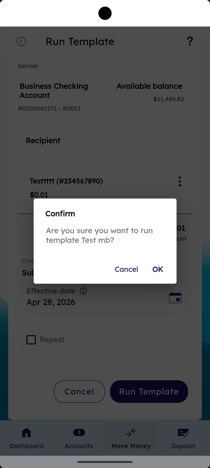

#### Step 10: Pick an Authentication Method

The **Verification** screen opens with the Summerville logo and *"Select your authentication method"*. Pick **Text** or **Call** with the masked phone number on file. Tap **Continue**.

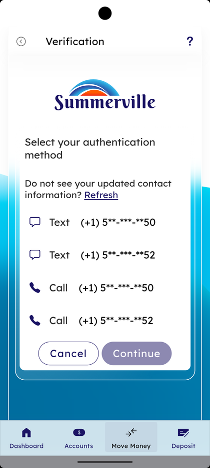

#### Step 11: Enter the OTP

The **User Verification** screen reads *"One-Time Passcode (OTP) Has Been Sent To"* with the masked number. Enter the passcode and tap **Submit**. *"Didn't receive your code? Retry in 56 s"* covers the resend window.

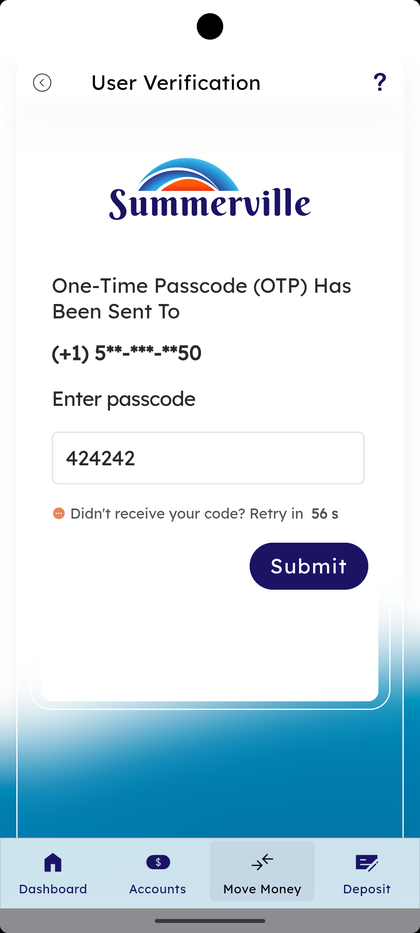

#### Step 12: Run Template Success

A **Run Template** dialog appears: *"Template run successful. Successfully submitted transfers to N recipients."* Tap **Click here for details** to see the per-recipient breakdown, or **OK** to return.

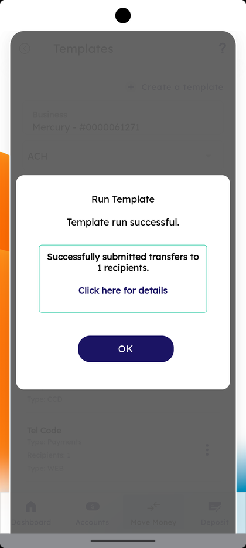

#### Step 13: Tap + Create a Template

Back on Templates, tap **+ Create a template** at the top right. The **Transfer Template** form opens with **Template details — Template name**, **Template description (optional)**, and **Template access rights — Edit** showing how many user roles can access this template. **Transfer details** below has **Payment type — Select** and **Sender — Select**.

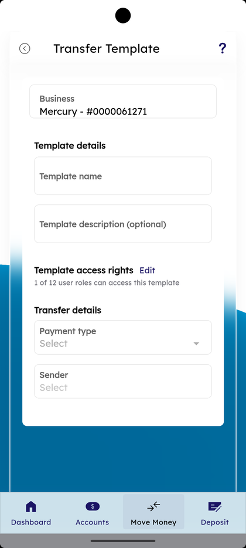

#### Step 14: Pick Payment Type

Tap **Payment type**. Two options appear: **External Transfer** or **Domestic Wire Transfer**.

#### Step 15: Pick Template Type

Tap **Template type** below Payment type. Three options appear: **Payments**, **Collections**, **Payroll**.

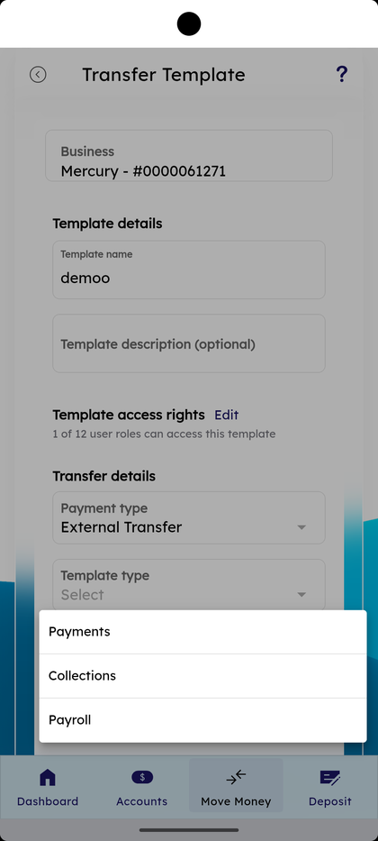

#### Step 16: Pick Sec Code

Tap **Sec Code**. Three options appear: **CCD (Cash Concentration or Disbursement)**, **PPD (Prearranged Payment and Deposit)**, **WEB (Internet-Initiated/Mobile Entries)**.

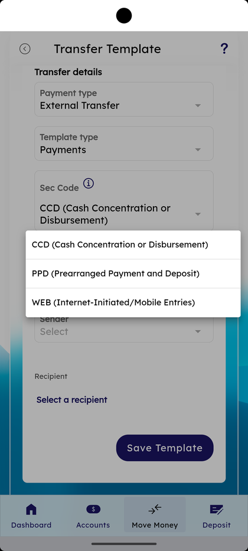

#### Step 17: Pick Company Entry Description

Tap **Company Entry Description** and choose **Payment** or **Custom**. Custom lets you type a label that appears on the receiving statement.

#### Step 18: Pick Sender

Tap **Sender**. The list shows business accounts with **Available balance** (e.g., **Business Checking Account #0001**, **Business Savings Account #0002**). Pick one.

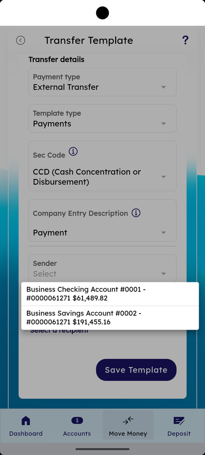

#### Step 19: Tap Select a Recipient

Below the form, tap **Select a recipient**. The action highlights and a recipient picker opens.

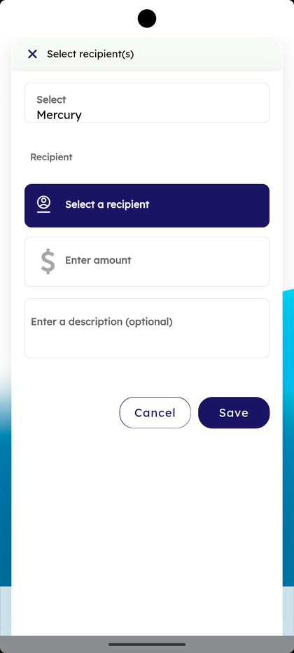

#### Step 20: Pick Recipient(s) for the Template

The **Select recipient(s)** sheet opens with the **Select** dropdown for the business and a list of recipients. Tap a recipient to attach.

#### Step 21: Add Amount and Description per Recipient

The **Select recipient(s)** sheet shows **Recipient** with the picked row, **Enter amount** ($), **Enter a description (optional)**, and **Cancel** / **Save** buttons. Type the amount and tap **Save**.

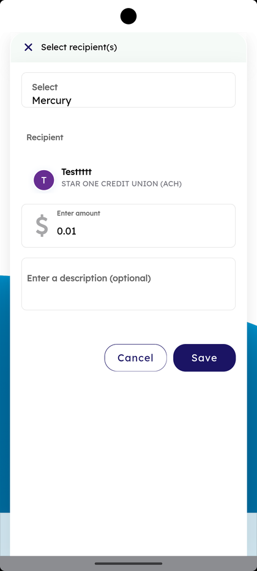

#### Step 22: Tap Save Template and Confirm

Tap **Save Template** at the bottom of the form. A **Confirm** dialog appears: *"Are you sure you want to create the template <name>?"* with **Cancel** and **OK**. Tap **OK** to save.

#### Step 23: Schedule a Repeat Run

If the Repeat tick is on during Run, the **Repeat Transfer** sheet opens with **Select frequency** and **End on** dropdowns plus **Cancel** / **Save** to commit the recurrence.

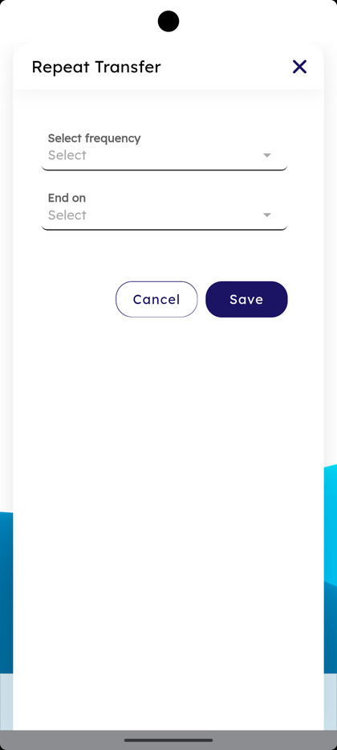

### Summary

Templates turn a recurring payment into a one-tap action — define the payment type, template type, sec code, company entry description, sender, and recipient once, then **Run Template** picks an effective date and runs through OTP verification before submitting. Long-press gives quick access to **Run / Detail / Edit / Duplicate / Remove** without opening each template. **Template access rights** control which roles can use a template, so payroll templates can be locked to authorized signers while vendor templates stay open. The Confirm dialogs on Run and Save Template are the guardrails against accidental commits.

### Key Use Cases

* Recurring vendor payment: **+ Create a template** → **Payment type — External Transfer** → **Sec Code — CCD** → recipient → **Save Template**.
* Quick run of an existing template: open **Templates** → tap the row → pick **Effective date** → **Run Template** → OTP → success.
* Scheduled re-run of a template: turn on **Repeat** during Run, set **Select frequency** + **End on**.
* Duplicate an existing template before editing: long-press → **Duplicate** → modify → **Save**.
* Audit before sending: long-press → **Detail** to read the saved configuration without running.
