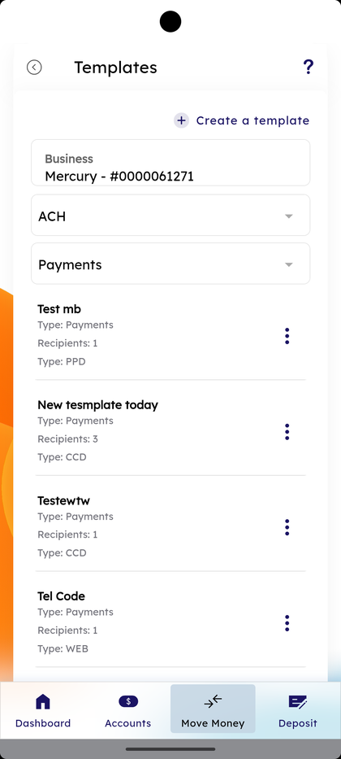
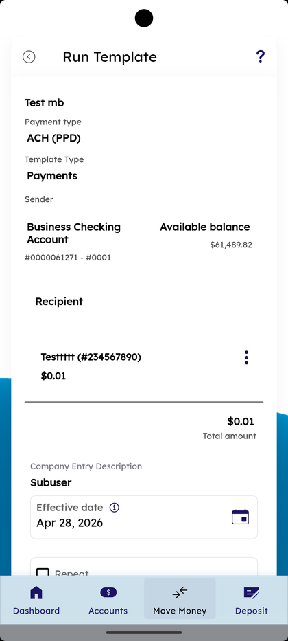
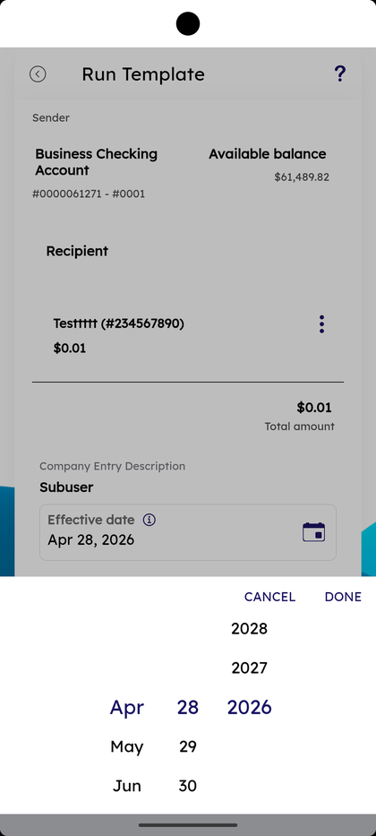
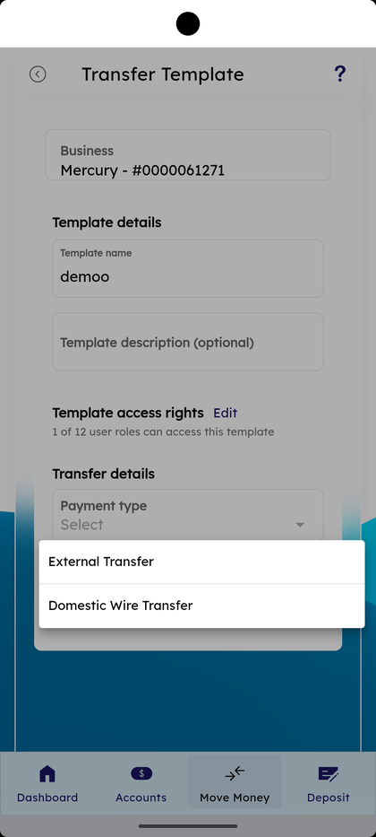
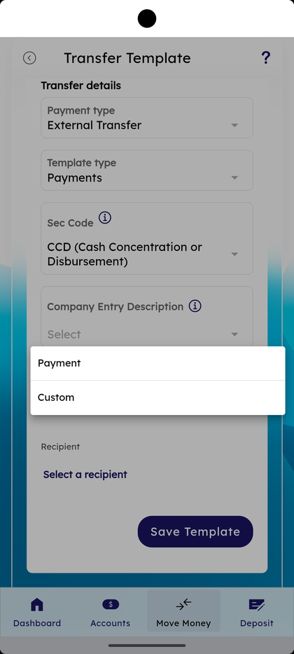
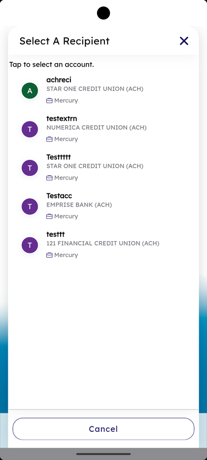
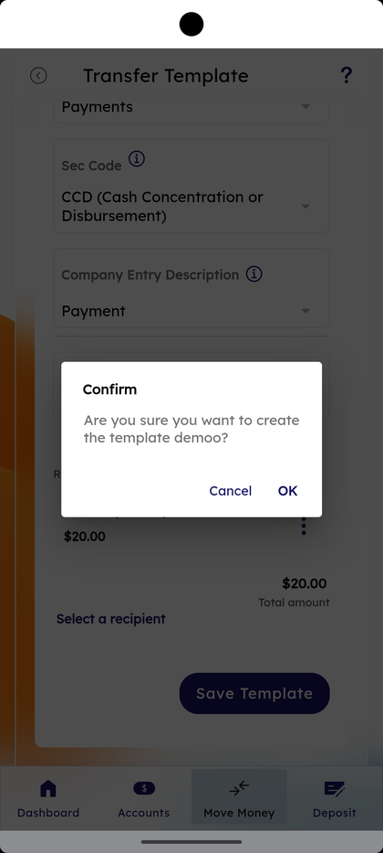

# Transfer Templates

_Summerville Mobile › Business Banking › Transfer Templates_

## Business Banking: Transfer Templates

> The Templates list — every saved transfer setup the business has, filtered by payment type (ACH) and template type (Payments). Tap a template to Run, or use **+ Create a template** to build a new one with a payment type, template type, sec code, company entry description, and recipient.

**How to get here:** Side Menu (☰) → **Business Settings** → **Templates**

### Step-by-Step Workflow

#### Step 1: Open Business Settings → Templates

From Side Menu (☰) → **Business Settings**, tap **Templates — Transfer templates**. The **Templates** screen opens with the business name at the top.

#### Step 2: Filter the List

The page has two dropdowns under the business header — payment type (defaulted to **ACH**) and template type (defaulted to **Payments**). The list below shows each template with **Type: Payments**, **Recipients: N**, and **Type: PPD / CCD / WEB**.

#### Step 3: Tap a Template to Run

Tap any template name in the list. The **Run Template** screen opens showing **Payment type — ACH (PPD)**, **Template Type — Payments**, the Sender business account with **Available balance**, the Recipient row with the masked account, and **Total amount**.

#### Step 4: Pick the Effective Date

Tap the **Effective date** calendar and use the month/day/year wheel. The default is the next available business date.

#### Step 5: Optionally Tick Repeat and Submit

Below the calendar there's an optional **Repeat** tick. Submit to send the templated transfer.

#### Step 6: Tap + Create a Template

Back on Templates, tap **+ Create a template** at the top right. The **Transfer Template** form opens with **Template details — Template name**, **Template description (optional)**, and **Template access rights — Edit** showing how many of the business's user roles can access this template.

#### Step 7: Pick Payment Type and Template Type

Under **Transfer details**, tap **Payment type** and pick **External Transfer** or **Domestic Wire Transfer**. Then pick **Template type — Payments**.

#### Step 8: Pick Sec Code and Company Entry Description

Tap **Sec Code** and pick (e.g., **CCD (Cash Concentration or Disbursement)**). Tap **Company Entry Description** and pick **Payment** or **Custom**.

#### Step 9: Pick a Recipient

Tap **Select a recipient**. The **Select A Recipient** sheet opens with the helper *"Tap to select an account."* and lists the business's recipients. Tap one to attach to the template.

#### Step 10: Tap Save Template and Confirm

Tap **Save Template** at the bottom. A **Confirm** dialog appears: *"Are you sure you want to create the template <name>?"* with **Cancel** and **OK**. Tap **OK** to save.

### Summary

Templates turn a recurring payment into a one-tap action — define the payment type, sec code, description, and recipient once, then **Run Template** picks an effective date and submits. **Template access rights** control which roles can use a template, so payroll templates can be locked to authorized signers while vendor templates stay open to a wider role. The Confirm dialog on Save Template is the guardrail against accidental creation.

### Key Use Cases

* Recurring vendor payment: **+ Create a template** → **Payment type — External Transfer** → **Sec Code — CCD** → recipient → **Save Template**.
* Quick run of an existing template: open **Templates** → tap the row → pick **Effective date** → submit.
* Payroll template restricted to authorized signers: **Template access rights — Edit** → set 1 of N roles before saving.
* Internal-only label: **Company Entry Description — Custom** → text the receiving statement should display.
