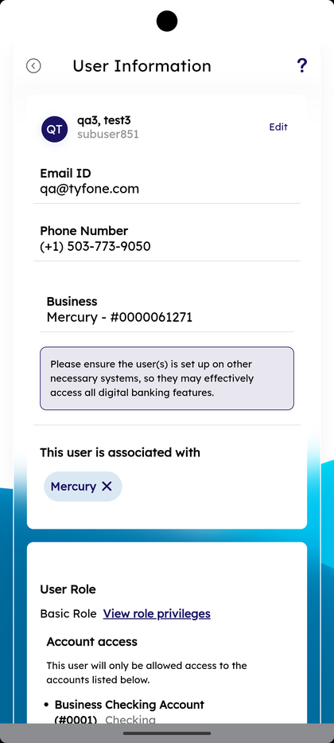
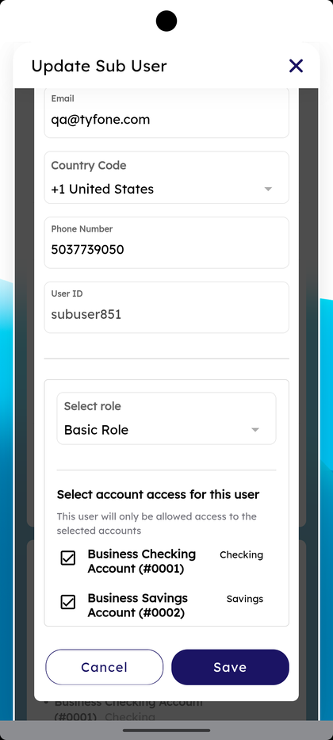
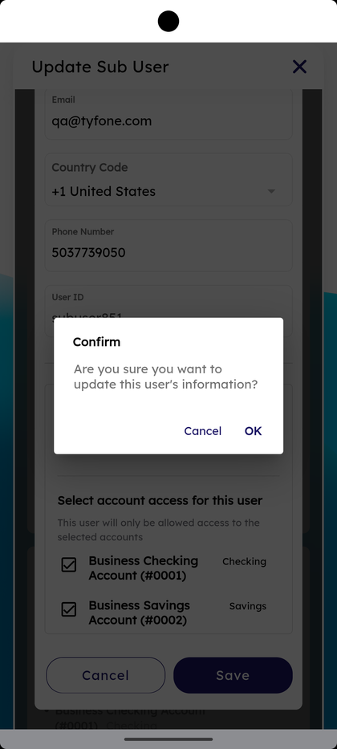

# User Management

_Summerville Mobile › Business Banking › User Management_

## Business Banking: User Management

> The User Management screen — every sub-user on the business grouped by role, with a **View** filter for **Active Users / New Authorized signers / Invited Users / Locked Users / Deactivated Users**, **+ Add a new user**, **User Information** detail view on tap, **Update Sub User** for edits with a Confirm dialog, and a Deactivate sheet that needs the business explicitly ticked.

**How to get here:** Side Menu (☰) → **Business Settings** → **User Management**

### Step-by-Step Workflow

#### Step 1: Open Business Settings → User Management

From Side Menu (☰) → **Business Settings**, scroll to **Manage** and tap **User Management — Create and Manage user for Business Banking**. The **User Management** screen opens.

#### Step 2: Review the User List

The screen shows **+ Add a new user** at the top right, the **Business** card with the membership number, the **View** dropdown defaulted to **Active Users**, and the helper *"Tap on a user to view more information."* Users are grouped by role with a colored initial avatar per row.

#### Step 3: Filter the View

Tap the **View** dropdown. Five filters appear: **Active Users**, **New Authorized signers**, **Invited Users**, **Locked Users**, **Deactivated Users**.

#### Step 4: Open User Information

Tap a user row. The **User Information** screen opens showing the user avatar, name and User ID, **Email ID**, **Phone Number**, **Business** with membership number, the helper *"Please ensure the user(s) is set up on other necessary systems, so they may effectively access all digital banking features."*, **This user is associated with** with a removable business chip, and a **User Role** card with **View role privileges** and **Account access** list.

#### Step 5: Tap Edit to Update Sub User

Tap **Edit** in the top right of User Information. The **Update Sub User** sheet opens with **First Name**, **Last Name**, **Email**, **Country Code**, **Phone Number**, **User ID**, **Select role**, and **Select account access for this user** (with the helper *"This user will only be allowed access to the selected accounts"*).

#### Step 6: Scroll, Pick Account Access, and Save

Scroll the Update Sub User sheet to the bottom. Tick the accounts under **Select account access for this user** (e.g., **Business Checking Account (#0001) — Checking**, **Business Savings Account (#0002) — Savings**) and tap **Save**, or **Cancel** to discard.

#### Step 7: Confirm the Update

A **Confirm** dialog appears: *"Are you sure you want to update this user's information?"* with **Cancel** and **OK**. Tap **OK** to commit.

#### Step 8: Deactivate a User

To deactivate, open the user and pick **Deactivate**. The **Deactivate** sheet opens: *"<user> is currently active with N business(es)"*, a tickbox for the business with the role in parentheses, and the prompt *"Are you sure you want to deactivate this user from the selected business(es)?"* Tap **Deactivate User** to confirm or **Cancel**.

### Summary

User Management is the people layer of business banking. The View filter lets the admin focus — Locked Users to unlock, Invited Users to chase, Deactivated Users to audit. User Information is the read-only profile; **Edit** opens Update Sub User where role, phone, and per-account access can change in one place. The Confirm dialog on update prevents fat-finger commits. Deactivate explicitly ticks each business so a user with multiple memberships isn't accidentally cut off everywhere.

### Key Use Cases

* Onboard a new sub-user: **+ Add a new user** → fill name, email, phone, **Select role**, account access.
* Audit a user's current access: tap the row → read **User Information** → **View role privileges** for the role's permission set.
* Promote a user to a different role: **Edit** → change **Select role** in Update Sub User → **Save** → **OK** in Confirm.
* Lock-out recovery: **View — Locked Users** → tap → unlock and re-set access.
* Offboarding: open the user → **Deactivate** → confirm with the business ticked.
