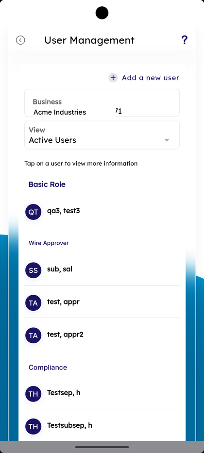
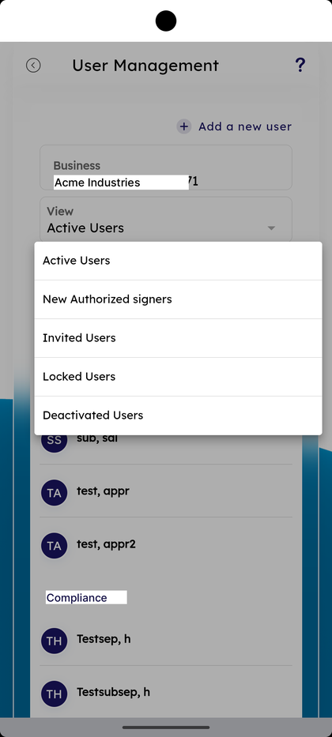
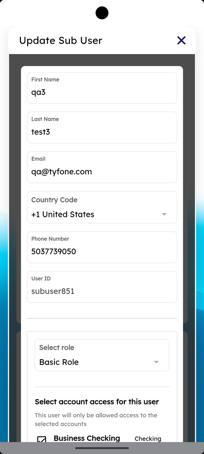
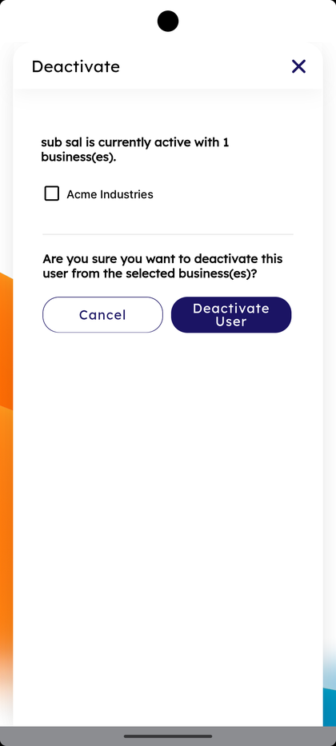

# User Management

_Summerville Mobile › Business Banking › User Management_

## Business Banking: User Management

> The User Management screen — every sub-user on the business grouped by role, with a **View** filter for **Active Users / New Authorized signers / Invited Users / Locked Users / Deactivated Users**, **+ Add a new user**, and **Update Sub User** on tap. Deactivation needs a confirm with the business explicitly ticked.

**How to get here:** Side Menu (☰) → **Business Settings** → **User Management**

### Step-by-Step Workflow

#### Step 1: Open Business Settings → User Management

From Side Menu (☰) → **Business Settings**, scroll to **Manage** and tap **User Management — Create and Manage user for Business Banking**. The **User Management** screen opens.

#### Step 2: Review the User List

The screen shows **+ Add a new user** at the top right, the **Business** card with the membership number, the **View** dropdown defaulted to **Active Users**, and the helper *"Tap on a user to view more information."* Users are grouped by role with a colored initial avatar per row.

#### Step 3: Filter the View

Tap the **View** dropdown. Five filters appear: **Active Users**, **New Authorized signers**, **Invited Users**, **Locked Users**, **Deactivated Users**.

#### Step 4: Tap a User to Update Sub User

Tap a user row. The **Update Sub User** sheet opens with **First Name**, **Last Name**, **Email**, **Country Code**, **Phone Number**, **User ID**, **Select role**, and **Select account access for this user** (with the helper *"This user will only be allowed access to the selected accounts"*).

#### Step 5: Deactivate a User

To deactivate, open the user and pick **Deactivate**. The **Deactivate** sheet opens: *"<user> is currently active with N business(es)"*, a tickbox for the business with the role in parentheses, and the prompt *"Are you sure you want to deactivate this user from the selected business(es)?"* Tap **Deactivate User** to confirm or **Cancel**.

### Summary

User Management is the people layer of business banking. The View filter lets the admin focus — Locked Users to unlock, Invited Users to chase, Deactivated Users to audit. Update Sub User edits role and per-account access in one place. The Deactivate confirm explicitly ticks each business so a user with multiple memberships isn't accidentally cut off everywhere.

### Key Use Cases

* Onboard a new sub-user: **+ Add a new user** → fill name, email, phone, **Select role**, account access.
* Promote a user to a different role: tap the row → change **Select role** in Update Sub User.
* Lock-out recovery: **View — Locked Users** → tap → unlock and re-set access.
* Offboarding: tap the user → **Deactivate** → confirm with the business ticked.
