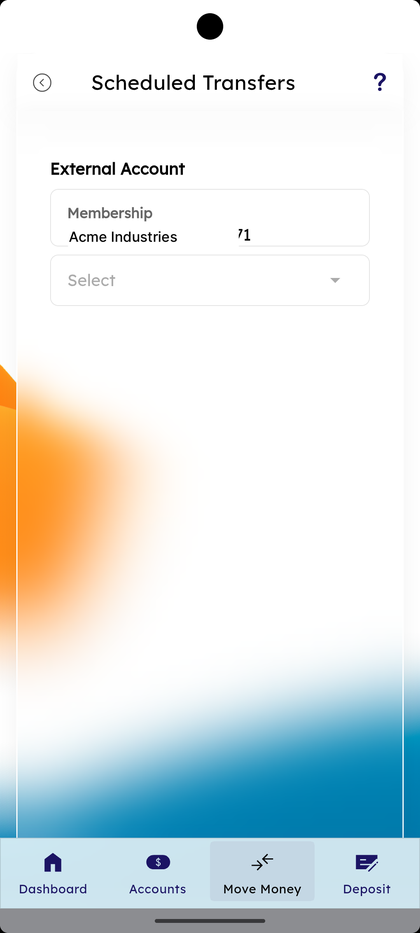
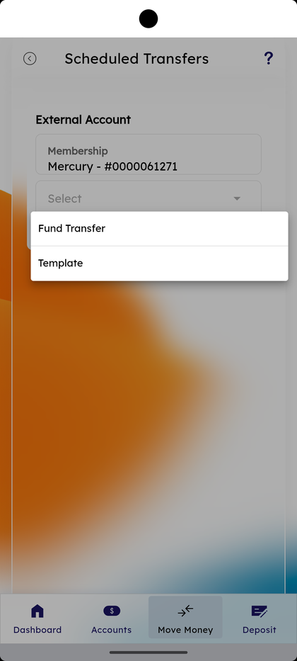
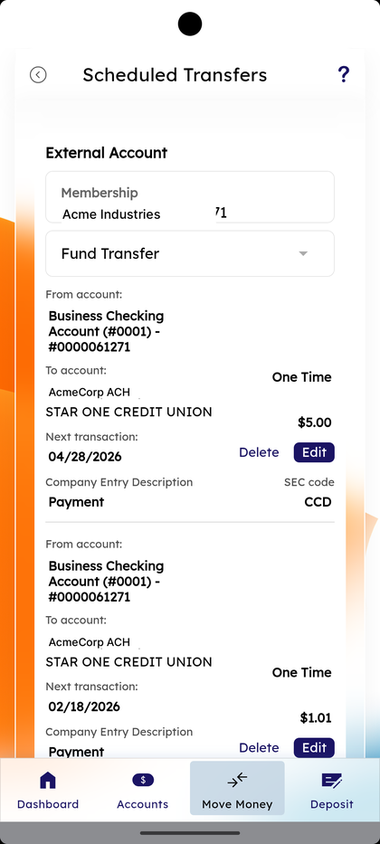
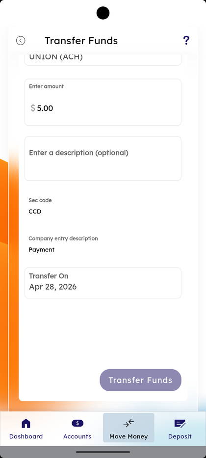
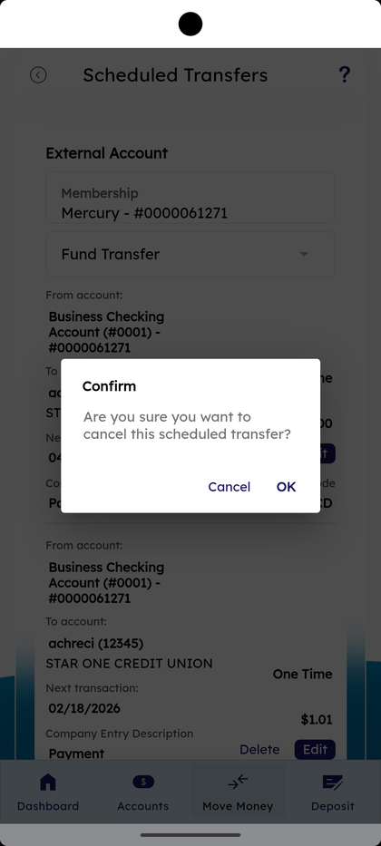
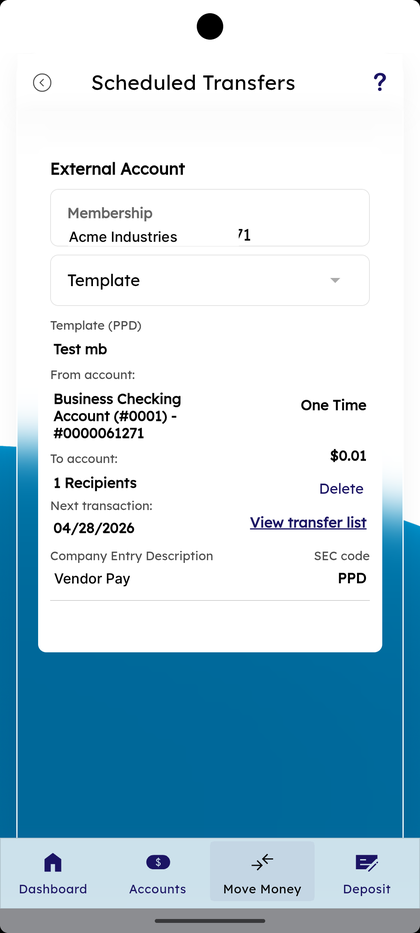
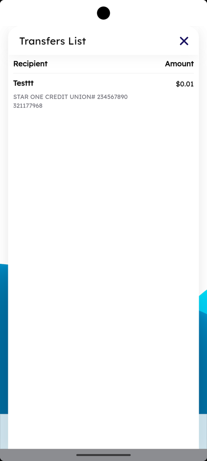

# View Scheduled Transfers

_Summerville Mobile › Business Banking › View Scheduled Transfers_

## Business Banking: View Scheduled Transfers

> The list of every scheduled transfer for the business, filtered by **Fund Transfer** or **Template**. Each card shows From / To accounts, the next transaction date, the amount, recurrence, Company Entry Description, SEC code, and inline **Delete** / **Edit** controls. Edit re-opens the Transfer Funds form for that schedule; Delete fires a Confirm dialog before removing the next occurrence.

**How to get here:** Side Menu (☰) → **Business Settings** → **View Scheduled Transfers**

### Step-by-Step Workflow

#### Step 1: Open Business Settings → View Scheduled Transfers

From Side Menu (☰) → **Business Settings**, scroll to **More Options** and tap **View Scheduled Transfers**. The **Scheduled Transfers** screen opens with **External Account — Membership** showing the business and a **Select** dropdown.

#### Step 2: Pick Fund Transfer or Template

Tap **Select**. Two options appear: **Fund Transfer** and **Template**. Pick one to filter the list.

#### Step 3: Review Fund Transfer Cards

With **Fund Transfer** selected, each card shows **From account**, **To account**, **One Time** or recurrence, **Next transaction** date, the amount, **Company Entry Description**, **SEC code**, and inline **Delete** / **Edit** links.

#### Step 4: Tap Edit to Update a Schedule

Tap **Edit** on a card. The **Transfer Funds** form for that schedule opens with **Enter amount** pre-filled, **Enter a description (optional)**, **Sec code** (e.g., **CCD**), **Company entry description** (e.g., **Payment**), **Transfer On** date, and a **Transfer Funds** button to submit changes.

#### Step 5: Tap Delete and Confirm

Tap **Delete** on a card. A **Confirm** dialog appears: *"Are you sure you want to cancel this scheduled transfer?"* with **Cancel** and **OK**. Tap **OK** to remove the next occurrence.

#### Step 6: Switch to Template View

Switch the dropdown to **Template**. Each template-driven card shows **Template (PPD)**, the template name, From, **N Recipients**, **View transfer list** link, **Next transaction**, the amount, **Company Entry Description**, and **SEC code**.

#### Step 7: Tap View transfer list

On a Template card tap **View transfer list**. The **Transfers List** sheet opens with each recipient in two columns — **Recipient** (name + receiving institution + account number) and **Amount**.

### Summary

Scheduled Transfers is the single place to review every queued movement before it lands. The Fund Transfer view covers one-off and recurring fund transfers; the Template view covers transfers driven by a saved template, including the per-recipient breakdown via View transfer list. Inline Edit re-opens the Transfer Funds form so amount, description, sec code, and date can change in place. Delete fires a Confirm dialog so a fat-finger doesn't drop a real schedule.

### Key Use Cases

* Audit upcoming outgoing money for the week: **Fund Transfer** view, scan **Next transaction** dates and amounts.
* Spot a wrong recipient on a payroll run before it sends: **Template** view → **View transfer list** to see every recipient and amount.
* Cancel one upcoming transfer: tap **Delete** on the card → **OK** in Confirm.
* Change the date or amount: tap **Edit**, update, save.
