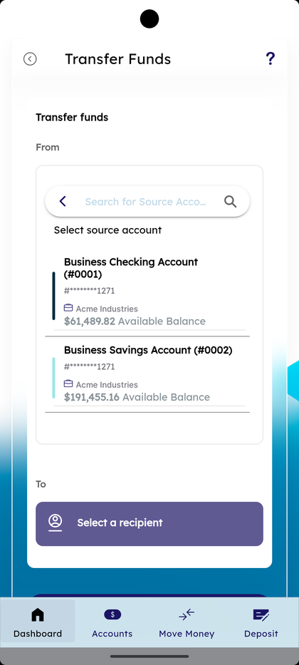
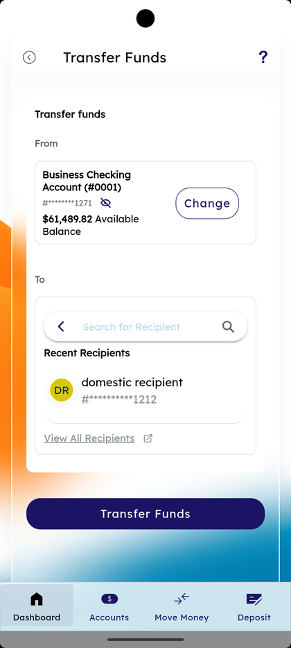
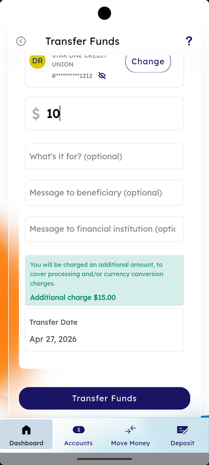
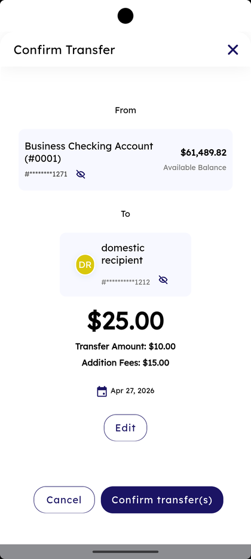
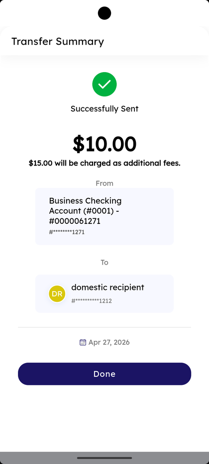

# Domestic Wire Transfer

_Summerville Mobile › Business Banking › Domestic Wire Transfer_

## Business Banking: Domestic Wire Transfer

> The Transfer Funds flow for domestic wires — pick the source business account, pick a recipient, enter the amount with optional What's it for / Message to beneficiary / Message to financial institution, then confirm. The form notes the additional charge for processing and currency conversion, and the success screen shows the breakdown plus the masked accounts.

**How to get here:** Side Menu (☰) → **Business Settings** → **Domestic Wire Transfer**

### Step-by-Step Workflow

#### Step 1: Open Business Settings → Domestic Wire Transfer

From Side Menu (☰) → **Business Settings**, tap **Domestic Wire Transfer**. The **Transfer Funds** form opens with a **Transfer funds** header.

#### Step 2: Pick a Source Account

Under **From**, tap **Search for Source Account** and pick a business account from the list. Each row shows the account name, masked number, and *"Available Balance"*.

#### Step 3: Pick a Recipient

Under **To**, tap **Search for Recipient** and pick from **Recent Recipients** or use **View All Recipients**. The picked recipient row shows the recipient name and masked account.

#### Step 4: Enter Amount and Optional Messages

Tap the dollar field and type the amount. Below the amount are three optional fields: **What's it for? (optional)**, **Message to beneficiary (optional)**, and **Message to financial institution (optional)**.

#### Step 5: Review the Additional Charge

A green note appears below the messages: *"You will be charged an additional amount, to cover processing and/or currency conversion charges. Additional charge $15.00."* The **Transfer Date** field shows the requested date.

#### Step 6: Tap Transfer Funds

Tap the **Transfer Funds** button at the bottom of the form. The **Confirm Transfer** screen opens.

#### Step 7: Confirm Transfer

The Confirm Transfer screen shows From, To, the total combining **Transfer Amount** and **Addition Fees**, the calendar date, and an **Edit** link. Tap **Confirm transfer(s)** to submit or **Cancel** to go back.

#### Step 8: Transfer Summary — Successfully Sent

The **Transfer Summary** screen shows a green check, **Successfully Sent**, the transfer amount, the line *"$15.00 will be charged as additional fees."*, From and To cards with masked numbers, and the date. Tap **Done** to return.

### Summary

Domestic Wire Transfer is the high-value rails for time-sensitive business payments — the additional $15.00 charge is shown inline before confirmation and again on the success screen so the total isn't a surprise. The three optional message fields carry intent end-to-end: *What's it for* is the internal note, *Message to beneficiary* prints on the receiving side, *Message to financial institution* is for routing instructions. Confirm transfer(s) commits the wire and the cancel window is short, so the **Edit** link on the confirm screen is the last stop to fix mistakes.

### Key Use Cases

* Closing payment on a real-estate or M&A transaction: pick the source, recipient, amount, fill **Message to beneficiary** with the closing reference, **Confirm transfer(s)**.
* Time-sensitive vendor payment that won't wait for ACH: same flow with **What's it for** as the invoice number.
* Paying a financial institution directly: use **Message to financial institution** for routing/reference instructions.
* Confirming a wire actually sent: read **Transfer Summary — Successfully Sent** including the additional fees breakdown, then **Done**.
